# Implementation Plan: Codex usage metering and cost attribution (#906, absorbs #1008)

**Date:** 2026-07-27
**Design:** Technical track; tier L — full architecture review
**Stories:** `.docs/stories/2026-07-27-codex-usage-metering-and-cost-attribution-906.md`
**Conflict check:** `.docs/conflicts/2026-07-27-codex-usage-metering-and-cost-attribution-906.md`
**Architecture:** `.docs/architecture/2026-07-27-codex-usage-metering-and-cost-attribution-906.md`
**ADRs:** `adr-2026-07-27-cost-unmetered-is-a-first-class-state.md`,
`adr-2026-07-27-additive-cost-block-evolution-and-split-aggregates.md`
**Source:** jstoup111/ai-conductor#906 (absorbs jstoup111/ai-conductor#1008)

## Summary

Codex dispatches currently report as fully-metered `$0.00`: `parseCodexJsonl` produces tokens
but no `costUsd`, and `cost-rollup.ts:54` turns that absence into a zero while
`cost-rollup.ts:56` declines to mark the dispatch unmetered. Three defects are fixed — the `$0`
fabrication, a multi-turn token undercount, and two dropped token fields — by introducing a
third metering state (`cost-unmetered`), evolving the committed `## Cost` block additively, and
splitting cost aggregation from token aggregation. #1008's KPI rendering gap is absorbed so the
new state is actually visible.

## Technical Approach

- Sum `turn.completed.usage` across turns in `parseCodexJsonl`; derive `numTurns` from the event
  count; map `cache_write_input_tokens` and `reasoning_output_tokens`.
- Leave `costUsd` and `durationMs` **absent** for Codex — never `0`.
- Add one exported classification helper returning `fully-metered | cost-unmetered | unmetered`,
  and call it from every site that reasons about metering rather than re-deriving the rule
  (ADR-a consequence; repo Design Principle).
- Grow the `## Cost` block by addition only, so records already on main keep parsing.
- Split `kpi-report`'s single `partial` gate into a cost gate and a token gate.

Test seams are the exported pure helpers (`parseCodexJsonl`, the classifier, `parseCostBlock`,
`renderShippedRecordWithCost`), per `.agents/skills/write-tests/SKILL.md` — not full
`Conductor.run()` fixtures. No ordinary test invokes the `codex` binary.

## Prerequisites

- Work in a worktree on `feat/codex-usage-metering-906`.
- Run tests from `src/conductor` (`npm test`, `npm run typecheck:test` — the plain `typecheck`
  target excludes `test/`).
- **Do not bump `VERSION`** — this repo stays version-locked pre-v1; `CHANGELOG.md`
  `[Unreleased]` only.

## Tasks

### Task 1: Commit a real captured Codex JSONL fixture
**Story:** 7 — The parser is pinned against a real captured Codex stream — HP-1
**Type:** happy-path

**Steps:**
1. Add `src/conductor/test/fixtures/codex-exec-json-turn-completed.jsonl` containing a real
   `codex exec --json` transcript (a capture from `codex-cli 0.145.0` is recorded verbatim in
   `.docs/architecture/2026-07-27-codex-usage-metering-and-cost-attribution-906.md`, decision 5).
2. Add a header comment recording the CLI version the capture came from, mirroring
   ADR-2026-07-22-a's "re-verify if the CLI result schema changes" note.
3. Write a test that reads the fixture and asserts `parseCodexJsonl` returns the usage values
   present in the captured `turn.completed`; confirm it passes against current code (this task
   pins existing behavior, it does not change it).
4. Commit with message: `test(codex): pin usage parsing to a real captured exec --json stream`.

**Files:** `src/conductor/test/fixtures/codex-exec-json-turn-completed.jsonl`,
`src/conductor/test/execution/codex-provider.test.ts`

**Wired-into:** none (test-only)

**Dependencies:** none

---

### Task 2: Accumulate Codex usage across turns
**Story:** 1 — Codex usage accumulates across every turn of a dispatch — HP-1, HP-2, NP-1
**Type:** happy-path

**Steps:**
1. Add failing tests for a three-turn stream (expect summed input/output and `numTurns: 3`), a
   single-turn stream (unchanged totals), and a malformed turn (well-formed turns still sum, no
   `NaN`) — RED.
2. Change `codex-provider.ts:93-100` from assignment to accumulation; count `turn.completed`
   events into `numTurns`.
3. Run the focused test file plus Task 1's fixture test — GREEN.
4. Commit with message: `fix(codex): sum token usage across all turns of a dispatch`.

**Files:** `src/conductor/src/execution/codex-provider.ts`,
`src/conductor/test/execution/codex-provider.test.ts`

**Wired-into:** `parseCodexJsonl` (already called at `codex-provider.ts:306`)

**Dependencies:** Task 1

---

### Task 3: Capture Codex cache-creation and reasoning tokens
**Story:** 2 — Codex cache-creation and reasoning tokens are captured — HP-1, NP-1
**Type:** happy-path

**Steps:**
1. Add failing tests mapping `cache_write_input_tokens` → `cacheCreation` and
   `reasoning_output_tokens` → `reasoningOutput`, plus a test that an omitted field stays
   **absent** rather than `0` — RED.
2. Add optional `reasoningOutput` to `TokenUsage` in `llm-provider.ts:1-9`.
3. Map both fields in `parseCodexJsonl`, guarded by `typeof === 'number'` like the existing
   `cached_input_tokens` handling.
4. Run focused tests plus `npm run typecheck:test` — GREEN.
5. Commit with message: `fix(codex): record cache-creation and reasoning token classes`.

**Files:** `src/conductor/src/execution/llm-provider.ts`,
`src/conductor/src/execution/codex-provider.ts`,
`src/conductor/test/execution/codex-provider.test.ts`,
`src/conductor/test/execution/llm-provider-token-usage.test.ts`

**Wired-into:** `parseCodexJsonl`

**Dependencies:** Task 2

---

### Task 4: Add the metering classification helper and fix the rollup
**Story:** 3 — A dispatch with tokens but no cost is classified cost-unmetered — HP-1, HP-2, NP-1, NP-2
**Type:** happy-path

**Steps:**
1. Add failing tests for the classifier: tokens+cost → `fully-metered`; tokens, no cost →
   `cost-unmetered`; no usage → `unmetered`; explicit `costUsd: 0` → `fully-metered` (a measured
   zero, not an absence) — RED.
2. Add failing rollup tests: a cost-unmetered dispatch adds tokens, adds **nothing** to
   `costUsd`, increments `costUnmetered.count`, and leaves `unmetered.count` untouched; a Claude
   dispatch behaves exactly as today — RED.
3. Export the classifier from `cost-rollup.ts` (or a small shared module) and add
   `costUnmetered: { count: number }` to `CostRollup` and `ProviderCostRollup`, defaulted in
   `zeroUsageRollup()`.
4. Rewrite `addDispatch` (`cost-rollup.ts:43-60`) to call the classifier and accumulate `costUsd`
   only when a numeric cost is present. Leave the existing `unmetered` branch semantics intact.
5. Run focused tests — GREEN.
6. Commit with message: `fix(cost): classify absent provider cost as cost-unmetered, never zero`.

**Files:** `src/conductor/src/engine/cost-rollup.ts`,
`src/conductor/test/engine/cost-rollup.test.ts`

**Wired-into:** `computeCostRollup` (`cost-rollup.ts:62`), already called by
`shipped-record-cli.ts:120`

**Dependencies:** Task 3

---

### Task 5: Write `cost_unmetered` into the committed `## Cost` block
**Story:** 4 — The committed `## Cost` block records cost-unmetered, additively — HP-1, NP-3, NP-4
**Type:** happy-path

**Steps:**
1. Add failing tests: the rendered block contains a top-level `cost_unmetered:` line and a
   `cost_unmetered:` field on each `providers:` entry; every pre-existing line keeps its current
   name, order, and format; render→parse→render is byte-identical; `parseShippedRecord`
   frontmatter parsing is unaffected — RED.
2. Extend `renderShippedRecordWithCost` (`shipped-record.ts:146-172`) additively. Change no
   existing line. Keep all additions after the closing `---` fence.
3. Run focused tests — GREEN.
4. Commit with message: `feat(shipped-record): record cost-unmetered dispatches in the Cost block`.

**Files:** `src/conductor/src/engine/shipped-record.ts`,
`src/conductor/test/engine/shipped-record.test.ts`

**Wired-into:** `shipped-record-cli.ts:120-121`

**Dependencies:** Task 4

---

### Task 6: Parse the new field with backward compatibility
**Story:** 4 — The committed `## Cost` block records cost-unmetered, additively — NP-1, NP-2
**Type:** negative-path

**Steps:**
1. Add failing tests: `parseCostBlock` reads `cost_unmetered` when present; a Cost block copied
   verbatim from a record already committed on main (no `cost_unmetered` line) parses successfully
   with the field defaulting to `0` — RED.
2. Extend `parseCostBlock` (`kpi-report.ts:37-67`) with a defaulted lookup, following the existing
   `num('cache_read') ?? 0` pattern, and a `providers:` sub-block parser.
3. Verify the `^name:` anchoring still cannot match two-space-indented provider lines.
4. Run focused tests — GREEN.
5. Commit with message: `fix(kpi): parse cost-unmetered and per-provider cost data`.

**Files:** `src/conductor/src/engine/kpi-report.ts`,
`src/conductor/test/engine/kpi-report.test.ts`

**Wired-into:** `conduct-ts kpi`

**Dependencies:** Task 5

---

### Task 7: Split cost aggregation from token aggregation
**Story:** 5 — Cost-unmetered work still contributes to token aggregates — HP-1, NP-1, NP-2
**Type:** happy-path

**Steps:**
1. Add failing tests: a feature with `cost_unmetered > 0` and `unmetered == 0` contributes its
   tokens to the aggregate while its cost is excluded and its line is marked cost-partial; a
   feature with `unmetered > 0` is still excluded from both; when every feature is cost-unmetered
   the token aggregate is non-zero and the cost total renders as unavailable rather than `0` — RED.
2. Replace the single `partial` gate at `kpi-report.ts:124-136` with separate cost and token
   gates, and differentiate the rendered marker.
3. Run focused tests — GREEN.
4. Commit with message: `fix(kpi): keep token aggregates when only cost is unmetered`.

**Files:** `src/conductor/src/engine/kpi-report.ts`,
`src/conductor/test/engine/kpi-report.test.ts`

**Wired-into:** `conduct-ts kpi`

**Dependencies:** Task 6

---

### Task 8: Render per-provider attribution and the six hidden fields (#1008)
**Story:** 6 — `conduct kpi` renders per-provider and previously-hidden fields — HP-1, HP-2, NP-1
**Type:** happy-path

**Steps:**
1. Add failing tests: each provider's tokens, cost, cost-unmetered count and dispatches render
   attributed by name; `cache_read`, `cache_creation`, `dispatches`, `retries`, `halts`, and
   `unmetered duration_ms` all render; a record with no `providers:` sub-block renders top-level
   totals without error — RED.
2. Extend the `conduct kpi` renderer.
3. Run focused tests — GREEN.
4. Commit with message: `feat(kpi): render per-provider cost attribution and cache spend`.

**Files:** `src/conductor/src/engine/kpi-report.ts`,
`src/conductor/test/engine/kpi-report.test.ts`

**Wired-into:** `conduct-ts kpi`

**Dependencies:** Task 7

---

### Task 9: Acceptance coverage for the end-to-end metering path
**Story:** 3 — A dispatch with tokens but no cost is classified cost-unmetered — HP-1, HP-2
**Type:** happy-path

**Steps:**
1. Add `src/conductor/test/acceptance/codex-usage-metering-and-cost-attribution-906.acceptance.test.ts`
   driving the real internal flow — a mixed Claude+Codex `events.jsonl` through
   `computeCostRollup` → `renderShippedRecordWithCost` → `parseCostBlock` → KPI render — with a
   deterministic fake at the provider boundary only.
2. Assert the Codex contribution appears in tokens, is absent from cost, and is reported as
   cost-unmetered rather than `$0`.
3. Run the full suite: `cd src/conductor && npm test` and confirm the
   `AGGREGATE_TEST_SUITE_PASS` sentinel — GREEN.
4. Commit with message: `test(acceptance): cover mixed-provider cost metering end to end`.

**Files:** `src/conductor/test/acceptance/codex-usage-metering-and-cost-attribution-906.acceptance.test.ts`

**Wired-into:** none (test-only)

**Dependencies:** Task 8

---

### Task 10: Update documentation and changelog
**Story:** 8 — Documentation reflects the new metering states — HP-1
**Type:** happy-path

**Steps:**
1. Document `cost_unmetered` (top-level and per-provider) in `docs/reference/artifacts.md` and
   **remove** the #1008 "Known limitation" note at lines 534-540, which Task 8 makes untrue.
2. Update the `conduct-ts kpi` entry in `docs/reference/cli.md` for the new output.
3. Add a `CHANGELOG.md` `[Unreleased]` entry — this is a notable reader-visible implementation
   change. **Do not touch `VERSION`** (repo is version-locked pre-v1).
4. Assess the release gate: this changes no `settings.json` schema, hook wiring, skill symlink
   target, or `bin/conduct` CLI *surface* — only the stdout of an existing read-only report. If
   the path-based classifier flags a breaking surface anyway, commit a waiver under
   `.docs/release-waivers/2026-07-27-codex-usage-metering-and-cost-attribution-906.md` naming the
   flagged canonical surface verbatim, rather than inventing an empty migration block.
5. Run `test/test_harness_integrity.sh` — GREEN.
6. Commit with message: `docs(cost): document cost-unmetered metering and per-provider KPI output`.

**Files:** `docs/reference/artifacts.md`, `docs/reference/cli.md`, `CHANGELOG.md`

**Wired-into:** none (documentation)

**Dependencies:** Task 9

## Task Dependency Graph

```mermaid
flowchart LR
    T1["T1 real fixture"] --> T2["T2 sum across turns"]
    T2 --> T3["T3 cache/reasoning fields"]
    T3 --> T4["T4 classifier + rollup"]
    T4 --> T5["T5 write cost_unmetered"]
    T5 --> T6["T6 parse + back-compat"]
    T6 --> T7["T7 split aggregates"]
    T7 --> T8["T8 per-provider render (#1008)"]
    T8 --> T9["T9 acceptance"]
    T9 --> T10["T10 docs + changelog"]
```

The chain is linear because each task's tests depend on the prior task's shape. Tasks 5 and 6
(writer and reader) must land in the same batch — see conflict C1.

## Risks carried from review

- **R1 / C2** — Task 7 is what prevents the KPI aggregate from silently emptying. It must not be
  deferred past Task 6, or an intermediate commit reports across zero features.
- **R3** — Task 4's classifier must be the single source of the rule; a later task re-deriving it
  inline reintroduces the defect class.
- **R4** — Task 1's fixture header records the pinned CLI version so schema drift is detectable.
