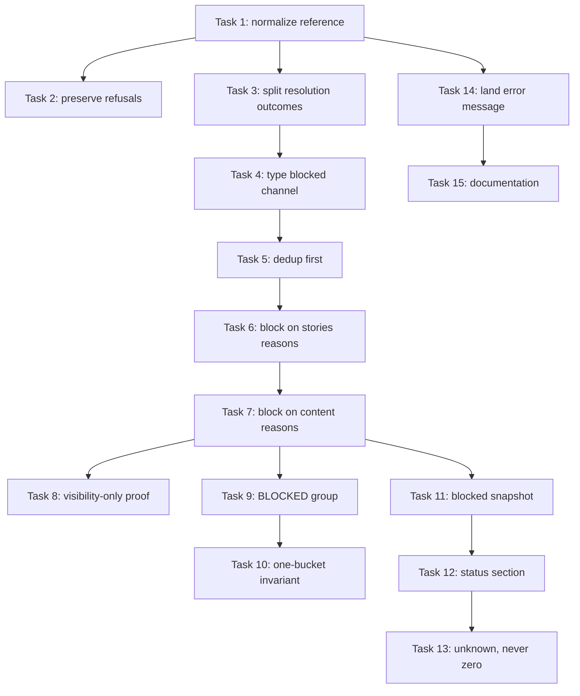

# Implementation Plan: Blocked Merged Specs Are Visible, Never Skipped

**Date:** 2026-08-05
**Design:** `.docs/decisions/adr-2026-08-05-blocked-classification-after-dedup.md`
**Stories:** `.docs/stories/annotated-stories-line-makes-a-merged-spec-silentl.md`
**Conflict check:** Clean as of 2026-08-05

## Summary

Make an unbuildable merged spec blocking and visible instead of silently skipped. Fifteen
small tasks add token-first normalization to the shared stories-reference resolver, split the
two stories-resolution failures apart, reorder the discovery gauntlet so dedup precedes
classification, emit a structured `blocked` channel for every content decline, render a
`BLOCKED` dashboard group, persist a per-pass snapshot that `conduct-ts daemon status` reads
offline, and make the land-time refusal name the accepted reference forms.

## Technical Approach

- Normalization is a separate pure step inside `plan-stories-reference.ts` that runs before
  the existing validation: backtick span, else leading Markdown link, else first
  whitespace-delimited token. Every current refusal stays exactly where it is, so both
  callers (discovery and land) relax identically.
- `resolveStoriesRef` stops returning a single `null`. It returns a discriminated outcome —
  resolved path, unresolvable reference, or resolved-but-absent target — because the two
  failures have different remedies.
- `discoverBacklog` gains a `blocked: BlockedSpecItem[]` member alongside `items`, `waiting`,
  and `gated`, populated by a collector that also drives the existing `warnOnce` logging. The
  four current `merged spec cannot build — …` lines keep their wording verbatim; two new
  lines are added for the stories reasons under the same dedup.
- The per-plan gauntlet is reordered so `isProcessed` and shipped-by-stem run *before*
  stories resolution. Content-hash shipped dedup stays after content vetting, because it
  needs the stories content; the split is recorded in-code.
- `.daemon/blocked.json` is written per pass by whole-file atomic rewrite, mirroring
  `.daemon/gated.json`. `runDaemonStatus` reads it with no git and no network, labels its age,
  and reports unknown when it is missing or unparseable.
- `landSpec` keeps its existing assertion and only gains a better error message plus a `/plan`
  documentation paragraph.

## Prerequisites

- `adr-2026-08-05-token-first-stories-reference-normalization`,
  `adr-2026-08-05-blocked-is-a-distinct-state-from-halted`, and
  `adr-2026-08-05-blocked-classification-after-dedup` are APPROVED.
- Stories carry `Status: Accepted`; conflict-check has zero blocking conflicts.
- Tests follow `.agents/skills/write-tests/SKILL.md`: narrowest seam, injected boundaries,
  isolated temporary roots, awaited cleanup, and no real LLM, GitHub, registry, or network
  calls. Discovery tests drive the existing injected `treeSource` rather than a real git repo.

## Tasks

### Task 1: Normalize an annotated stories reference to its path

**Story:** Story 1 — An annotated `**Stories:**` line resolves, happy path 1
**Type:** happy-path

**Steps:**
1. Add failing tests for the four annotated shapes: backticked path plus parenthetical, bare
   path plus parenthetical, Markdown link plus em-dash annotation, and backticked path with an
   unbalanced trailing parenthesis.
2. Verify the focused resolver tests fail (RED).
3. Add a private `normalizeStoriesReference` step to `plan-stories-reference.ts` that reduces
   the captured remainder to one reference — backtick span, else leading Markdown link, else
   first whitespace-delimited token — and call it before the existing validation.
4. Verify the focused resolver tests pass (GREEN).
5. Commit with message: "fix(plan-ref): resolve an annotated Stories reference"

**Files:** `src/conductor/src/engine/plan-stories-reference.ts`,
`src/conductor/test/engine/plan-stories-reference.test.ts`

**Wired-into:** `src/conductor/src/engine/plan-stories-reference.ts#resolvePlanStoriesPath`

**Dependencies:** none

### Task 2: Preserve every existing reference refusal and shape

**Story:** Story 1 — An annotated `**Stories:**` line resolves, negative paths
**Type:** negative-path

**Steps:**
1. Add a failing table test covering the unannotated bare path, inline-code path, and Markdown
   link; POSIX-absolute, Windows drive-absolute, and UNC references with annotations;
   traversal with an annotation; a non-path first token; an empty reference; and a plan with
   no `**Stories:**` line.
2. Verify the table fails only where the new behaviour is required (RED).
3. Adjust normalization ordering so the backtick span is checked before the Markdown link and
   before token splitting, keeping every refusal in the validation step untouched.
4. Verify every table row passes (GREEN).
5. Commit with message: "test(plan-ref): pin stories-reference refusals under normalization"

**Files:** `src/conductor/src/engine/plan-stories-reference.ts`,
`src/conductor/test/engine/plan-stories-reference.test.ts`

**Wired-into:** none (no new production surface)

**Dependencies:** Task 1

### Task 3: Distinguish an unresolvable reference from a missing target

**Story:** Story 2 — Discovery classifies unbuildable merged specs, happy paths 1 and 2
**Type:** infrastructure

**Steps:**
1. Add failing tests asserting `resolveStoriesRef` reports `unresolvable` for a plan whose
   line cannot resolve and `missing` for a plan whose resolved target is absent from the
   injected tree source.
2. Verify the focused discovery tests fail (RED).
3. Change `resolveStoriesRef` to return a discriminated outcome instead of `string | null`,
   and update its single caller to branch on it with no behaviour change yet.
4. Verify the focused discovery tests pass (GREEN).
5. Commit with message: "refactor(daemon): split stories-ref resolution outcomes"

**Files:** `src/conductor/src/engine/daemon-backlog.ts`,
`src/conductor/test/engine/daemon-backlog.test.ts`

**Wired-into:** `src/conductor/src/engine/daemon-backlog.ts#discoverBacklog`

**Dependencies:** Task 1

### Task 4: Type the blocked channel

**Story:** Story 2 — Discovery classifies unbuildable merged specs, happy path 1
**Type:** infrastructure

**Steps:**
1. Add a failing test asserting `discoverBacklog` returns an empty `blocked` array for a
   fixture with only buildable specs.
2. Verify the focused discovery test fails (RED).
3. Add the exported `BlockedSpecItem` type — slug, reason (`unresolvable-stories-ref` |
   `stories-missing` | `stories-not-approved` | `no-dependency-tree` | `missing-coherence`),
   and remedy — and add `blocked: BlockedSpecItem[]` to the discovery result, returned empty.
4. Verify the focused discovery test passes (GREEN).
5. Commit with message: "feat(daemon): add the blocked discovery channel type"

**Files:** `src/conductor/src/engine/daemon-backlog.ts`,
`src/conductor/test/engine/daemon-backlog.test.ts`

**Wired-into:** `src/conductor/src/engine/daemon-backlog.ts#discoverBacklog`

**Dependencies:** Task 3

### Task 5: Run dedup before content classification

**Story:** Story 3 — Finished work is never reported as blocked, happy paths 1 and 2
**Type:** infrastructure

**Steps:**
1. Add failing tests asserting that a plan with an unresolvable reference produces no blocked
   entry when its slug has a processed marker, and none when its stem matches a committed
   shipped record.
2. Verify the focused discovery tests fail (RED).
3. Move the `isProcessed` check and the shipped-by-stem check ahead of stories resolution in
   the per-plan gauntlet, leaving content-hash shipped dedup where it is, and add the in-code
   comment recording why the two halves are split.
4. Verify the focused discovery tests pass (GREEN).
5. Commit with message: "refactor(daemon): dedup before content classification"

**Files:** `src/conductor/src/engine/daemon-backlog.ts`,
`src/conductor/test/engine/daemon-backlog.test.ts`

**Wired-into:** `src/conductor/src/engine/daemon-backlog.ts#discoverBacklog`

**Dependencies:** Task 4

### Task 6: Block on the two stories-resolution reasons, out loud

**Story:** Story 2 — Discovery classifies unbuildable merged specs, happy paths 1, 2 and 6
**Type:** happy-path

**Steps:**
1. Add failing tests asserting a blocked entry with reason `unresolvable-stories-ref` (remedy
   naming the plan file and the accepted forms) and one with reason `stories-missing` (remedy
   naming the resolved path), each with a warn-once log line emitted exactly once across two
   passes.
2. Verify the focused discovery tests fail (RED).
3. Replace the silent `continue` with a collector call that records the blocked entry and
   routes its message through the existing `warnOnce`.
4. Verify the focused discovery tests pass (GREEN).
5. Commit with message: "fix(daemon): never drop a spec whose stories ref fails to resolve"

**Files:** `src/conductor/src/engine/daemon-backlog.ts`,
`src/conductor/test/engine/daemon-backlog.test.ts`

**Wired-into:** `src/conductor/src/engine/daemon-backlog.ts#discoverBacklog`

**Dependencies:** Task 5

### Task 7: Block on the three existing content reasons, preserving their log wording

**Story:** Story 2 — Discovery classifies unbuildable merged specs, happy paths 3, 4 and 5
**Type:** happy-path

**Steps:**
1. Add failing tests asserting blocked entries with reasons `stories-not-approved`,
   `no-dependency-tree`, and `missing-coherence`, and asserting each existing
   `merged spec cannot build — …` log line is emitted with its current wording unchanged.
2. Verify the focused discovery tests fail (RED).
3. Record a blocked entry at each of the three existing `warnOnce` skip sites, alongside the
   existing log call rather than in place of it.
4. Verify the focused discovery tests pass (GREEN).
5. Commit with message: "feat(daemon): classify content skips as blocked work"

**Files:** `src/conductor/src/engine/daemon-backlog.ts`,
`src/conductor/test/engine/daemon-backlog.test.ts`

**Wired-into:** `src/conductor/src/engine/daemon-backlog.ts#discoverBacklog`

**Dependencies:** Task 6

### Task 8: Prove blocked classification changes no eligible spec

**Story:** Story 3 — Finished work is never reported as blocked, negative paths
**Type:** negative-path

**Steps:**
1. Add a failing test that runs discovery over one fixture containing buildable, gated,
   waiting, processed, shipped-by-content, and each blocked-reason spec, asserting the
   eligible `items` set is identical to the pre-change expectation apart from the
   newly-resolvable annotated plan.
2. Add failing cases asserting a spec deduped by content hash produces no blocked entry, and
   that a spec which is neither processed, shipped, nor parked *is* reported as blocked.
3. Verify the focused discovery tests fail (RED).
4. Fix any ordering or suppression defect the fixture exposes.
5. Verify the focused discovery tests pass (GREEN).
6. Commit with message: "test(daemon): pin blocked classification as visibility-only"

**Files:** `src/conductor/test/engine/daemon-backlog.test.ts`

**Wired-into:** none (no new production surface)

**Dependencies:** Task 7

### Task 9: Render the BLOCKED dashboard group

**Story:** Story 4 — The startup dashboard renders a BLOCKED group, happy paths
**Type:** happy-path

**Steps:**
1. Add failing tests asserting a `BLOCKED (2)` group with a reason-and-remedy line per slug,
   a `BLOCKED (0)` group when the channel is present but empty, and the full group order
   `PARKED`, `HALTED`, `IN-PROGRESS`, `RETAINED WORKTREES`, `GATED`, `BLOCKED`, `WAITING`,
   `ELIGIBLE`, `PROCESSED`.
2. Verify the focused dashboard tests fail (RED).
3. Carry blocked entries through `scanInheritedState` into the dashboard state and render the
   group between `GATED` and `WAITING`, following the `gatedSpecLine` shape.
4. Verify the focused dashboard tests pass (GREEN).
5. Commit with message: "feat(dashboard): render the BLOCKED group"

**Files:** `src/conductor/src/engine/daemon-dashboard.ts`,
`src/conductor/test/engine/daemon-dashboard.test.ts`

**Wired-into:** `src/conductor/src/engine/daemon-dashboard.ts#renderDashboard`

**Dependencies:** Task 7

### Task 10: Keep every spec in exactly one dashboard group

**Story:** Story 4 — The startup dashboard renders a BLOCKED group, negative paths
**Type:** negative-path

**Steps:**
1. Add failing tests asserting a slug present in both blocked and halted renders only under
   `HALTED`, a blocked-and-parked slug renders only under `PARKED`, and a dashboard state with
   the blocked channel absent renders byte-identically to today with no `BLOCKED` group.
2. Verify the focused dashboard tests fail (RED).
3. Filter blocked entries by the parked, halted, retained, and processed sets before
   rendering, and make the group conditional on the channel being present.
4. Verify the focused dashboard tests pass (GREEN).
5. Commit with message: "fix(dashboard): keep BLOCKED out of higher-precedence buckets"

**Files:** `src/conductor/src/engine/daemon-dashboard.ts`,
`src/conductor/test/engine/daemon-dashboard.test.ts`

**Wired-into:** `src/conductor/src/engine/daemon-dashboard.ts#renderDashboard`

**Dependencies:** Task 9

### Task 11: Persist the per-pass blocked snapshot

**Story:** Story 5 — `daemon status` explains a blocked spec, happy paths 1 and 3
**Type:** infrastructure

**Steps:**
1. Add failing tests asserting a pass writes every blocked entry plus a written-at timestamp
   to `.daemon/blocked.json` in an isolated temporary root, and that a subsequent pass with a
   fixed spec replaces the file contents rather than merging.
2. Verify the focused snapshot tests fail (RED).
3. Write the snapshot per pass via temp-file-plus-rename, reusing the gated snapshot writer's
   shape.
4. Verify the focused snapshot tests pass (GREEN).
5. Commit with message: "feat(daemon): persist the per-pass blocked snapshot"

**Files:** `src/conductor/src/engine/daemon-backlog.ts`,
`src/conductor/test/engine/daemon-backlog.test.ts`

**Wired-into:** `src/conductor/src/engine/daemon-backlog.ts#discoverBacklog`

**Dependencies:** Task 7

### Task 12: Render the blocked section in `daemon status`

**Story:** Story 5 — `daemon status` explains a blocked spec, happy paths 2 and 4
**Type:** happy-path

**Steps:**
1. Add failing tests asserting `runDaemonStatus` renders a per-repository blocked section
   listing each slug with its reason and remedy and labelling the snapshot's age, using an
   injected repository root and no git or network boundary.
2. Verify the focused status tests fail (RED).
3. Add the snapshot reader and section renderer to `daemon-observe-cli.ts`, alongside the
   existing gated section.
4. Verify the focused status tests pass (GREEN).
5. Commit with message: "feat(status): show blocked specs with reason and remedy"

**Files:** `src/conductor/src/engine/daemon-observe-cli.ts`,
`src/conductor/test/engine/daemon-observe-cli.test.ts`

**Wired-into:** `src/conductor/src/engine/daemon-observe-cli.ts#runDaemonStatus`

**Dependencies:** Task 11

### Task 13: Report unknown rather than zero, and never fail a status run

**Story:** Story 5 — `daemon status` explains a blocked spec, negative paths
**Type:** negative-path

**Steps:**
1. Add failing tests asserting an absent snapshot renders blocked state as unknown, an
   unparseable snapshot renders unknown and exits successfully, and a snapshot write failure
   during a pass still returns blocked entries and leaves eligible dispatch unaffected.
2. Verify the focused tests fail (RED).
3. Make the reader fail soft to an unknown state and the writer's failure non-fatal to the
   pass.
4. Verify the focused tests pass (GREEN).
5. Commit with message: "fix(status): unknown blocked state is never reported as zero"

**Files:** `src/conductor/src/engine/daemon-observe-cli.ts`,
`src/conductor/src/engine/daemon-backlog.ts`,
`src/conductor/test/engine/daemon-observe-cli.test.ts`

**Wired-into:** `src/conductor/src/engine/daemon-observe-cli.ts#runDaemonStatus`

**Dependencies:** Task 12

### Task 14: Make the land refusal name the accepted reference forms

**Story:** Story 6 — Landing refuses an unusable stories reference, happy paths 1 and 2
**Type:** happy-path

**Steps:**
1. Add failing tests asserting a worktree whose plan carries an annotated reference to the
   selected stories artifact lands successfully, and that an unresolvable reference fails with
   an error naming the selected artifact, the resolved value, and the accepted forms including
   a trailing annotation.
2. Verify the focused land tests fail (RED).
3. Rewrite the `landSpec` stories-reference error message; the assertion itself is unchanged.
4. Verify the focused land tests pass (GREEN).
5. Commit with message: "fix(engineer): name the accepted Stories reference forms on refusal"

**Files:** `src/conductor/src/engine/engineer/land-spec.ts`,
`src/conductor/test/engine/engineer/land-spec.test.ts`

**Wired-into:** `src/conductor/src/engine/engineer/land-spec.ts#landSpec`

**Dependencies:** Task 1

### Task 15: Document the blocked state and the accepted reference forms

**Story:** Story 6 — Landing refuses an unusable stories reference, happy path 3
**Type:** documentation

**Steps:**
1. Add failing tests asserting an unrelated-but-valid stories artifact still fails the land
   and that a traversal reference reports its resolved value as invalid.
2. Verify the focused land tests fail (RED).
3. Make any assertion adjustment those cases require.
4. Verify the focused land tests pass (GREEN).
5. Document the accepted `**Stories:**` reference forms in the `/plan` skill; document the
   `BLOCKED` group and the `daemon status` blocked section in
   `docs/guides/running-the-daemon.md` and `docs/reference/cli.md`; add a blocked-spec entry
   to `docs/runbooks/stalled-or-stuck-feature.md` noting that the remedy is on the default
   branch and that a first pass after upgrading may dispatch previously-invisible specs in a
   repository without processed markers.
6. Run `test/test_harness_integrity.sh` and fix any failure.
7. Commit with message: "docs: blocked specs, and the accepted Stories reference forms"

**Files:** `skills/plan/SKILL.md`, `docs/guides/running-the-daemon.md`,
`docs/reference/cli.md`, `docs/runbooks/stalled-or-stuck-feature.md`,
`src/conductor/src/engine/engineer/land-spec.ts`,
`src/conductor/test/engine/engineer/land-spec.test.ts`

**Wired-into:** none (no new production surface)

**Dependencies:** Task 14

## Task Dependency Graph

