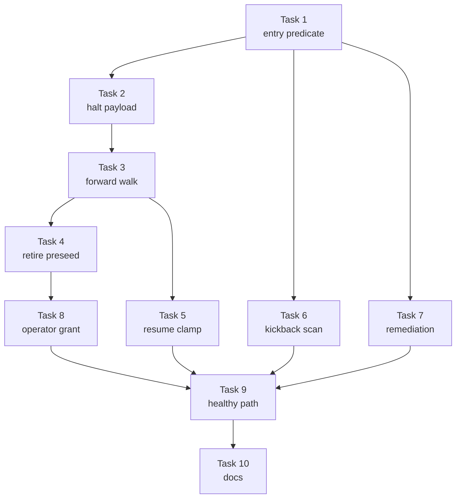

# Implementation Plan: fail-closed DECIDE entry for autonomous runs

**Date:** 2026-08-03
**Design:** .docs/decisions/adr-2026-08-03-fail-closed-decide-entry.md
**Stories:** .docs/stories/daemon-autonomous-runs-must-fail-closed-on-any-amb.md
**Conflict check:** Clean as of 2026-08-03

## Summary

Replace `kickback-policy.ts` with a fail-closed `decide-entry-policy.ts`, consult it at all four
navigation seams, retire the daemon's blind DECIDE preseed in favour of a verified fast-forward,
and add an explicit `conduct decide-grant` affordance that is the only way an autonomous run may
enter DECIDE. Ten TDD tasks: one pure predicate, one HALT renderer, four seam wirings, the
preseed retirement, the grant CLI, an end-to-end healthy-path proof, and documentation.

## Technical Approach

- Extract one pure, I/O-free predicate returning `enter | fast-forward | halt`. Every branch it
  cannot positively prove safe returns `halt`. Phase, tier-skippability, and contract presence
  are resolved from the passed `StepDefinition[]`, never a hardcoded name list.
- Render every refusal through one payload builder so the five operator-facing fields are a
  contract rather than an ad-hoc string, always written with halt class `needs-human`.
- Wire the predicate at the forward walk, the resume clamp, `scanKickbackVerdicts`, and
  `planRemediation`, preserving #551's cap-before-policy ordering and #647's halt-wins ordering.
- Collapse the two satisfaction authorities into one: `PRESEEDED_DONE` drops its DECIDE members
  and the engine answers satisfaction from the existing file-I/O `checkStepCompletion` predicate.
- Gate autonomous DECIDE entry behind a durable, step-scoped, single-use grant file that no
  engine code path can create.

## Prerequisites

- Approved ADR `adr-2026-08-03-fail-closed-decide-entry`.
- Existing Node/TypeScript stack and Vitest suite; no new external service or account.
- Test work follows `.agents/skills/write-tests/SKILL.md`: isolated temporary roots, faithful
  fakes at every third-party boundary, and no real daemon or provider calls.

## Tasks

### Task 1: Fail-closed entry predicate replacing the kickback policy

**Story:** 1
**Type:** happy-path, negative-path

**Steps:**
1. Write failing unit tests for all eight ordered rules: interactive passthrough; unresolvable
   target and undefined phase both halting; BUILD-phase entering; tier-skippable fast-forwarding
   as `skipped`; contract-less fast-forwarding as `skipped`; satisfied fast-forwarding as `done`;
   an in-scope grant entering; and `satisfied: false` and `satisfied: 'unknown'` both halting.
2. Verify the tests fail because `decideEntryDisposition` does not exist.
3. Rename `kickback-policy.ts` to `decide-entry-policy.ts` and implement the predicate with the
   `DecideEntryDisposition` union. Keep it pure — no filesystem access, no step-name literals.
4. Verify GREEN, and that the existing `kickback-policy.test.ts` cases survive as the
   BUILD-routes and DECIDE-halts rows of the new suite.
5. Commit with message: `feat(engine): fail-closed DECIDE entry predicate`.

**Files:**
- `src/conductor/src/engine/decide-entry-policy.ts`
- `src/conductor/test/engine/decide-entry-policy.test.ts`

**Wired-into:** `src/conductor/src/engine/conductor.ts#Conductor`

**Dependencies:** none

### Task 2: Structured needs-human HALT payload for every refusal

**Story:** 5
**Type:** happy-path, negative-path

**Steps:**
1. Write failing unit tests asserting the rendered body carries all five fields — source gate,
   requested target, evidence, why refused, operator choices — for each refusal cause, and that
   an unresolvable target name appears verbatim rather than normalized away.
2. Verify RED.
3. Implement `renderDecideEntryHalt` beside the predicate, returning the body string only; the
   caller pairs it with `writeHaltMarker(..., 'needs-human')` so the class is never optional.
4. Verify GREEN.
5. Commit with message: `feat(engine): structured DECIDE-entry halt payload`.

**Files:**
- `src/conductor/src/engine/decide-entry-policy.ts`
- `src/conductor/test/engine/decide-entry-halt-payload.test.ts`

**Wired-into:** `src/conductor/src/engine/conductor.ts#Conductor`

**Dependencies:** Task 1

### Task 3: Forward-walk seam refuses an unsatisfied DECIDE step

**Story:** 1
**Type:** happy-path, negative-path

**Steps:**
1. Write a failing acceptance spec: an autonomous conductor over a fixture whose
   `.docs/stories/<slug>.md` is absent halts with `.pipeline/HALT.class` containing exactly
   `needs-human`, names the missing artifact, dispatches no provider, and leaves `stories`
   unresolved in state. Add the interactive counterpart asserting the step still dispatches.
2. Verify RED — today the step dispatches an authoring session.
3. Consult the predicate at `conductor.ts:3081` before the dispatch decision, answering
   `satisfied` from `checkStepCompletion` via the existing `completionCtx`, and treating a
   throwing predicate as `'unknown'`.
4. Verify GREEN.
5. Commit with message: `feat(engine): refuse unsatisfied DECIDE entry on the forward walk`.

**Files:**
- `src/conductor/src/engine/conductor.ts`
- `src/conductor/test/acceptance/decide-entry-forward-walk.acceptance.test.ts`

**Wired-into:** `src/conductor/src/engine/conductor.ts#run`

**Dependencies:** Task 2

### Task 4: Retire the DECIDE preseed so the engine owns satisfaction

**Story:** 7
**Type:** happy-path, negative-path

**Steps:**
1. Rewrite `daemon-decide-preseed-ownership.acceptance.test.ts` to assert the replacement
   invariant — `PRESEEDED_DONE` contains no DECIDE step, and DECIDE resolution is owned by the
   engine predicate — citing this ADR in the spec header so the change reads as a moved contract
   rather than a weakened test.
2. Verify RED against the current derived constant.
3. Reduce `PRESEEDED_DONE` to `['worktree','memory']`, drop the tier branch from
   `preseedStepStatuses`, and update `audit-trail-daemon-wiring.integration.test.ts`'s iteration.
4. Verify GREEN, including that an unresolved tier now resolves to `L` at the single engine site
   rather than `M` at the preseed.
5. Commit with message: `refactor(daemon): engine owns DECIDE satisfaction, not the preseed`.

**Files:**
- `src/conductor/src/daemon-cli.ts`
- `src/conductor/test/acceptance/daemon-decide-preseed-ownership.acceptance.test.ts`
- `src/conductor/test/integration/audit-trail-daemon-wiring.integration.test.ts`

**Wired-into:** `src/conductor/src/daemon-cli.ts#preseedStepStatuses`

**Dependencies:** Task 3

### Task 5: Resume clamp refuses to land on a DECIDE step

**Story:** 2
**Type:** happy-path, negative-path

**Steps:**
1. Write a failing acceptance spec: an autonomous resume whose earliest unsatisfied gate is a
   DECIDE step halts `needs-human` naming `resume-clamp` as the source gate; a resume whose
   earliest unsatisfied gate is a BUILD step clamps and proceeds with no HALT.
2. Verify RED.
3. Consult the predicate on the clamped index in `findResumeIndex`, after
   `earliestUnsatisfiedGateIndex` returns and before the clamp is applied. Honour
   `adr-2026-07-11-verdict-aware-resume-entry` — refuse without mutating `conduct-state.json`.
4. Verify GREEN.
5. Commit with message: `feat(engine): refuse a resume clamp onto a DECIDE step`.

**Files:**
- `src/conductor/src/engine/conductor.ts`
- `src/conductor/test/acceptance/decide-entry-resume-clamp.acceptance.test.ts`

**Wired-into:** `src/conductor/src/engine/conductor.ts#findResumeIndex`

**Dependencies:** Task 3

### Task 6: Kickback scan detects and refuses unresolvable targets

**Story:** 3
**Type:** happy-path, negative-path

**Steps:**
1. Write a failing acceptance spec: a persisted verdict whose target is in no step definition
   halts `needs-human` with the name carried verbatim; a resolvable BUILD target still routes via
   `navigateBack`; and a cap-exhausted kickback still reports the unchanged ping-pong reason.
2. Verify RED — today an unknown target is never iterated and vanishes silently.
3. Widen the scan to all persisted verdicts carrying `kickback.from === stepName` rather than
   only `topo.kickbackTargets`, and consult the predicate in #551's established position: counter
   bump, event emit, cap check, predicate, `navigateBack`.
4. Verify GREEN, with `daemon-decide-kickback-halt.acceptance.test.ts` passing unmodified.
5. Commit with message: `feat(engine): refuse unresolvable kickback targets`.

**Files:**
- `src/conductor/src/engine/conductor.ts`
- `src/conductor/test/acceptance/decide-entry-unknown-kickback.acceptance.test.ts`

**Wired-into:** `src/conductor/src/engine/conductor.ts#scanKickbackVerdicts`

**Dependencies:** Task 1

### Task 7: Remediation refuses an unresolvable disposition instead of defaulting to build

**Story:** 4
**Type:** happy-path, negative-path

**Steps:**
1. Write failing tests: a gap ledger with an unresolvable `disposition` halts naming it; an
   all-resolvable BUILD ledger routes exactly as today; a mixed ledger halts rather than routing
   on its resolvable subset.
2. Verify RED — today the unresolvable gap is skipped and the `'build'` initializer is returned.
3. Change `earliestRemediationTarget` to return `{ target, unresolved }` and halt in
   `planRemediation` on a non-empty `unresolved`, placed after the halt-gaps-win branch and
   before the phase check so #647 D1's ordering is untouched.
4. Verify GREEN, with `conductor-remediation-noop-guard.test.ts` and
   `kickback-build-noop-escalation.acceptance.test.ts` passing unmodified.
5. Commit with message: `feat(engine): refuse unresolvable remediation dispositions`.

**Files:**
- `src/conductor/src/engine/conductor.ts`
- `src/conductor/test/engine/earliest-remediation-target.test.ts`

**Wired-into:** `src/conductor/src/engine/conductor.ts#planRemediation`

**Dependencies:** Task 1

### Task 8: Explicit, step-scoped, single-use operator grant

**Story:** 6
**Type:** happy-path, negative-path

**Steps:**
1. Write failing tests: `conduct decide-grant --slug --step --reason` writes
   `.pipeline/decide-grant.json`; a granted step dispatches and the file is consumed; clearing
   the HALT with no grant re-halts identically; a grant for one step does not authorize another;
   a consumed grant does not authorize a second entry.
2. Verify RED.
3. Implement the grant reader/consumer beside the predicate and register the `decide-grant`
   command in `cli.ts`. No engine path writes a grant — only this command does.
4. Verify GREEN, and add a source assertion that no production module outside the command
   constructs a grant.
5. Commit with message: `feat(cli): operator-directed DECIDE grant`.

**Files:**
- `src/conductor/src/engine/decide-entry-policy.ts`
- `src/conductor/src/cli.ts`
- `src/conductor/test/acceptance/decide-entry-operator-grant.acceptance.test.ts`

**Wired-into:** `src/conductor/src/cli.ts#registerCommands, src/conductor/src/engine/conductor.ts#run`

**Dependencies:** Task 4

### Task 9: Healthy spec still reaches BUILD with no added dispatch

**Story:** 7
**Type:** happy-path, negative-path

**Steps:**
1. Write a failing end-to-end acceptance spec over a complete fixture spec: the autonomous run
   reaches `acceptance_specs` with zero provider dispatches for any DECIDE step and no HALT.
   Add the Small-tier case (no conflicts/architecture/coherence artifacts, each fast-forwarding
   as `skipped`), the contract-less case (`explore` and `complexity` fast-forward, never halt),
   and the unresolved-tier case resolving to `L`.
2. Verify RED where the assertions do not yet hold.
3. Fix any gap the spec exposes; assert satisfaction is answered only by file I/O so the
   negative-path cost requirement is mechanically pinned.
4. Verify GREEN and run the full aggregate suite.
5. Commit with message: `test(engine): pin the healthy DECIDE fast-forward path`.

**Files:**
- `src/conductor/src/engine/conductor.ts`
- `src/conductor/test/acceptance/decide-entry-healthy-fast-forward.acceptance.test.ts`

**Wired-into:** `src/conductor/src/engine/conductor.ts#run`

**Dependencies:** Task 5, Task 6, Task 7, Task 8

### Task 10: Documentation, runbook, and migration block

**Story:** none (infrastructure: documentation and migration for Stories 1-7)
**Type:** infrastructure

**Steps:**
1. Update `docs/explanation/gates.md` with the fail-closed DECIDE-entry invariant across all four
   seams, superseding the two-seam description left by #551.
2. Add `conduct decide-grant` to `docs/reference/cli.md` and the operational note to
   `docs/guides/running-the-daemon.md`.
3. Update `docs/runbooks/stalled-or-stuck-feature.md` with the DECIDE-entry HALT procedure,
   stating explicitly that clearing the HALT alone does not authorize entry and a grant is
   required.
4. Draft the `## Migration` bash fence for the PR body — required because `bin/conduct` CLI gains
   a subcommand.
5. Run `test/test_harness_integrity.sh` and commit with message: `docs: fail-closed DECIDE entry`.

**Files:**
- `docs/explanation/gates.md`
- `docs/reference/cli.md`
- `docs/guides/running-the-daemon.md`
- `docs/runbooks/stalled-or-stuck-feature.md`

**Wired-into:** `docs/explanation/gates.md#gates`

**Dependencies:** Task 9

## Task Dependency Graph

Tasks 6 and 7 depend only on Task 1 and may run in parallel with the Task 3–5 chain.

## Coverage Check (story → task)

| Story | Tasks |
| --- | --- |
| 1 | 1, 3 |
| 2 | 5 |
| 3 | 6 |
| 4 | 7 |
| 5 | 2 |
| 6 | 8 |
| 7 | 4, 9 |
