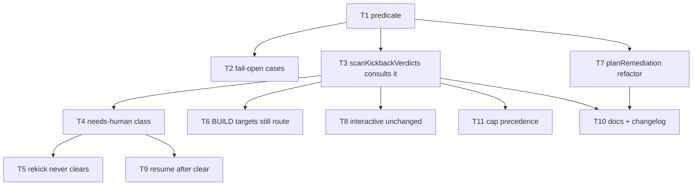

# Implementation Plan: daemon-mode DECIDE kickbacks HALT instead of re-running (#551)

**Date:** 2026-07-27
**Stem:** daemon-mode-kickbacks-route-human-judgment-gaps-in
**Track:** technical (no PRD)
**Tier:** M
**Design:** `.docs/decisions/adr-2026-07-27-daemon-decide-kickback-halt.md` (APPROVED)
**Architecture:** `.docs/architecture/2026-07-27-daemon-mode-kickbacks-route-human-judgment-gaps-in.md`
**Review:** `.docs/decisions/architecture-review-2026-07-27-daemon-mode-kickbacks-route-human-judgment-gaps-in.md` (APPROVED)
**Stories:** `.docs/stories/daemon-mode-kickbacks-route-human-judgment-gaps-in.md`
**Conflict check:** Clean as of 2026-07-27 (4 conflicts resolved — see `.docs/conflicts/2026-07-27-daemon-mode-kickbacks-route-human-judgment-gaps-in.md`)

## Summary

Close the second of the conductor's two backward-navigation seams against autonomous DECIDE
re-authoring. Extract the phase rule that #644 inlined into `planRemediation` as a pure predicate,
and consult it from `scanKickbackVerdicts` — whose four possible targets (`prd`,
`architecture_review`, `stories`, `plan`) are **all** DECIDE-phase and today have no daemon gate
at all. 11 tasks.

## Technical Approach

**What is already done, and what is not.** `planRemediation` (`conductor.ts:1655`) already halts
in daemon mode when its chosen target is DECIDE-phase (`conductor.ts:1722-1737`, added by #644).
That covers dispositions authored by `/remediate`. It does **not** cover verdict-driven kickbacks:
`scanKickbackVerdicts` (`conductor.ts:6189-6231`) reads `.pipeline/gates/<step>.json` verdicts of
shape `{satisfied:false, kickback:{from, evidence}}`, bumps a counter, emits the `kickback` event,
HALTs past `MAX_KICKBACKS_PER_GATE`, and otherwise calls `navigateBack` — with no reference to
`this.daemon` and no reference to phase. Since `kickbackTarget: true` is set only on the four
DECIDE steps (`steps.ts:61, 85, 96, 117`), *every* kickback this function can route is a DECIDE
re-open.

**Why the daemon's preseed doesn't already stop it.** `PRESEEDED_DONE` (`daemon-cli.ts:288`)
marks DECIDE steps done before the loop starts. `navigateBack` (`conductor.ts:336`) sets the
target back to `pending` and cascade-stales downstream (`state.ts:166-183`); `selectNextGate`
then scans from `topo.regionStart`, which `deriveGateTopology` (`conductor.ts:250`) sets to the
first `kickbackTarget` — a DECIDE step. The preseed is a forward guard and does not survive a
rewind.

**Shape of the change.**

1. New pure module `src/conductor/src/engine/kickback-policy.ts` exporting
   `decideKickbackDisposition({target, steps, daemon}) → {kind:'route'} | {kind:'halt', reason}`.
   Phase is resolved from the passed `steps: StepDefinition[]`, never a hardcoded name list, so
   config-added custom DECIDE steps and any future `kickbackTarget` are covered (review F5). An
   unresolvable target name fails **open** (`route`) — an unknown step cannot be a DECIDE
   re-author, and failing closed there would halt daemons on custom topologies.
2. `scanKickbackVerdicts` consults it **after** the counter bump, event emit and cap check, and
   **before** `navigateBack` (ADR ordering; C1). On `halt` it writes the marker via
   `writeHaltMarker(body, 'needs-human')` — never a bare `writeFile` — then follows the canonical
   pair `writeState → surfaceRemediationPr(reason) → emit({type:'loop_halt', reason, prUrl})` and
   returns `'halt'`, which both call sites already propagate.
3. `planRemediation`'s inline check is replaced by a call to the same predicate, preserving the
   existing detail text and `{kind:'halt', detail}` shape exactly (S6).

**What must not change.** Deterministic kickbacks (`manual_test` `:2464`, `test_suite` `:4973`,
`wiring_check` `:5236`, non-completeness `build_review`) hardcode `build` and are untouched. The
rebase-invalidation re-open (`conductor.ts:4203-4238`) targets BUILD/SHIP gates only and is
untouched. `selector.ts` is untouched — its `loopGatesOnly` flag stays unwired (ADR rejected
option). No step-table, config, schema or CLI surface changes.

**Why no migration block or waiver.** The diff touches no `settings.json` schema, no hook wiring,
no skill symlink target and not `bin/conduct` — none of the four canonical breaking surfaces — so
the release gate has nothing to flag and neither a `## Migration` block nor a
`.docs/release-waivers/` file is appropriate.

## Prerequisites

None — no migrations, no new dependencies, no config keys.

## Tasks

### Task 1: Pure predicate module with the DECIDE rule
**Story:** S2 — BUILD-phase kickback targets stay fully autonomous
**Type:** happy-path

**Steps:**
1. Write failing table-driven unit tests over `ALL_STEPS`: with `daemon: true`, every step whose
   `phase === 'DECIDE'` yields `{kind:'halt'}` and every other step yields `{kind:'route'}`; with
   `daemon: false`, every step yields `{kind:'route'}`.
2. Verify RED (module does not exist — use a dynamic import so collection does not hard-fail).
3. Implement `decideKickbackDisposition` in a new `engine/kickback-policy.ts`: resolve
   `steps.find(s => s.name === target)?.phase`; halt only when `daemon && phase === 'DECIDE'`.
   Build the reason string naming the target and stating DECIDE is operator-only in daemon mode.
4. Verify GREEN.
5. Commit: "feat(engine): pure kickback phase policy predicate"

**Files likely touched:**
- src/conductor/src/engine/kickback-policy.ts — new module
- src/conductor/test/engine/kickback-policy.test.ts — new

**Wired-into:** src/conductor/src/engine/conductor.ts#scanKickbackVerdicts (Task 3) and #planRemediation (Task 7)
**Dependencies:** none

### Task 2: Unknown-target and empty-table fail-open cases
**Story:** S1 — A daemon-mode kickback aimed at a DECIDE step HALTs instead of re-opening it
**Type:** negative-path

**Steps:**
1. Write failing tests: a target name absent from `steps` returns `{kind:'route'}` under
   `daemon: true`; an empty `steps` array returns `{kind:'route'}`; a custom step object carrying
   `phase: 'DECIDE'` but a non-canonical name returns `{kind:'halt'}`.
2. Verify RED.
3. Adjust the predicate if needed so phase resolution is table-driven and undefined-safe.
4. Verify GREEN.
5. Commit: "test(engine): kickback policy fail-open on unresolvable target"

**Files likely touched:**
- src/conductor/src/engine/kickback-policy.ts
- src/conductor/test/engine/kickback-policy.test.ts

**Wired-into:** same as Task 1
**Dependencies:** Task 1

### Task 3: Consult the predicate in `scanKickbackVerdicts`
**Story:** S1 — A daemon-mode kickback aimed at a DECIDE step HALTs instead of re-opening it
**Type:** happy-path

**Steps:**
1. Write a failing acceptance spec: build a `Conductor` with `{mode:'auto', daemon:true,
   verifyArtifacts:true}` in the shape of
   `test/acceptance/daemon-mode-route-halt-user-input-required-through.acceptance.test.ts:137-152`;
   seed state through the tail with `writeTaskStatus` + evidence stamps; write a kickback verdict
   onto `plan` via `writeVerdict` with `kickback.from` set to the running gate; assert the run
   halts, `plan` is never dispatched, and the halt reason names `plan`.
2. Verify RED (today it navigates back and dispatches).
3. In `scanKickbackVerdicts`, after the cap check and before `navigateBack`, call
   `decideKickbackDisposition({target, steps, daemon: this.daemon})`; on `halt`, write the marker
   with the reason plus the verdict's `kickback.evidence`, `writeState`, `surfaceRemediationPr`,
   emit `loop_halt`, and return `'halt'`.
4. Verify GREEN.
5. Commit: "fix(engine): daemon-mode DECIDE kickback halts instead of re-opening"

**Files likely touched:**
- src/conductor/src/engine/conductor.ts — `scanKickbackVerdicts`
- src/conductor/test/acceptance/daemon-decide-kickback-halt.acceptance.test.ts — new

**Wired-into:** src/conductor/src/engine/conductor.ts#advanceTail (tail call site, conductor.ts:6473)
**Dependencies:** Task 1

### Task 4: Halt is classified `needs-human` and the sidecar is asserted
**Story:** S5 — The HALT is `needs-human`, so no sweep ever auto-clears it
**Type:** negative-path

**Steps:**
1. Write a failing spec asserting `.pipeline/HALT.class` contains exactly `needs-human` after the
   Task 3 halt (assert sidecar **content**, not merely `HALT` existence — a bare `writeFile`
   implementation must fail this).
2. Verify RED.
3. Ensure Task 3's halt goes through `writeHaltMarker(body, 'needs-human')` (`halt-marker.ts:37`).
4. Verify GREEN.
5. Commit: "fix(engine): classify DECIDE-kickback halt needs-human"

**Files likely touched:**
- src/conductor/src/engine/conductor.ts
- src/conductor/test/acceptance/daemon-decide-kickback-halt.acceptance.test.ts

**Wired-into:** same as Task 3
**Dependencies:** Task 3

### Task 5: `rekickSweep` never auto-clears the guard, across shas
**Story:** S5 — The HALT is `needs-human`, so no sweep ever auto-clears it
**Type:** negative-path

**Steps:**
1. Write failing tests in the shape of `test/engine/daemon-rekick.test.ts:157` and `:176`: a
   worktree halted with class `needs-human` is skipped by `rekickSweep`, no `.pipeline/HALT.cleared`
   and no `.pipeline/REKICK` appear, and it is skipped again at a **new** HEAD sha.
2. Verify RED/GREEN as appropriate — the sweep behavior already exists, so this pins it as a
   regression fence for this feature rather than adding behavior.
3. If already green, record it as a characterization test referencing this feature.
4. Commit: "test(engine): fence needs-human halts against rekick for DECIDE guard"

**Files likely touched:**
- src/conductor/test/engine/daemon-rekick.test.ts — added cases

**Wired-into:** none (regression fence over shipped `rekickSweep` behavior) — reached via Task 4
**Dependencies:** Task 4

### Task 6: BUILD-phase targets still route under `daemon: true`
**Story:** S2 — BUILD-phase kickback targets stay fully autonomous
**Type:** happy-path

**Steps:**
1. Write a failing/characterizing acceptance case: with `daemon: true`, a deterministic kickback
   to `build` navigates back and dispatches `build` — no HALT, no `HALT.class`.
2. Verify RED/GREEN.
3. No production change expected; if one is needed the guard is over-broad and must be narrowed.
4. Commit: "test(engine): BUILD-phase kickbacks stay autonomous under the DECIDE guard"

**Files likely touched:**
- src/conductor/test/acceptance/daemon-decide-kickback-halt.acceptance.test.ts

**Wired-into:** same as Task 3
**Dependencies:** Task 3

### Task 7: Replace the inline #644 check with the shared predicate
**Story:** S6 — The `planRemediation` guard is refactored without behavior change
**Type:** infrastructure

**Steps:**
1. Confirm the existing suites are green before touching anything
   (`conductor-remediation-noop-guard.test.ts`, `kickback-build-noop-escalation.acceptance.test.ts`).
2. Replace `conductor.ts:1722-1737`'s inline `targetPhase === 'DECIDE'` test with a call to
   `decideKickbackDisposition`, preserving the existing detail text and `{kind:'halt'}` shape and
   its position relative to the halt-wins ordering (`:1706-1713`) and the #647 D1 no-op guard
   (`:1738-1760`).
3. Verify those suites are still green **unmodified**.
4. Commit: "refactor(engine): planRemediation consults shared kickback policy"

**Files likely touched:**
- src/conductor/src/engine/conductor.ts — `planRemediation`

**Wired-into:** src/conductor/src/engine/conductor.ts#planRemediation (conductor.ts:1655)
**Dependencies:** Task 1

### Task 8: Interactive path regression proof
**Story:** S3 — Interactive `/conduct` kickbacks are provably unchanged
**Type:** negative-path

**Steps:**
1. Run `test/integration/gate-loop.test.ts` in full — in particular `:224` ("re-opens plan on
   kickback"), the front-half amendment suite at `:479`, and `:1599` (cap HALT).
2. Confirm every one passes **with no edit to that file**. A diff touching it fails this task.
3. Add one explicit interactive case to the new acceptance file: a `Conductor` built without
   `daemon: true` navigates back to `plan` on a DECIDE kickback and dispatches it.
4. Commit: "test(engine): interactive DECIDE kickbacks unchanged by the daemon guard"

**Files likely touched:**
- src/conductor/test/acceptance/daemon-decide-kickback-halt.acceptance.test.ts

**Wired-into:** same as Task 3
**Dependencies:** Task 3

### Task 9: Resume after a human clears the halt
**Story:** S5 — The HALT is `needs-human`, so no sweep ever auto-clears it
**Type:** negative-path

**Steps:**
1. Write a failing/characterizing spec in the shape of `test/engine/resume-verdict-clamp.test.ts`:
   after the operator satisfies the DECIDE verdict and clears the HALT, a resumed run
   (`{resume:true, daemon:true, verifyArtifacts:true}`) re-enters at the earliest unsatisfied gate
   and does **not** re-dispatch the resolved DECIDE step.
2. Verify RED/GREEN.
3. No production change expected — #532's clamp supplies the behavior; this pins the composition.
4. Commit: "test(engine): resume after cleared DECIDE-kickback halt does not re-walk"

**Files likely touched:**
- src/conductor/test/engine/resume-verdict-clamp.test.ts — added case

**Wired-into:** none (composition fence over shipped #532 clamp) — reached via Task 4
**Dependencies:** Task 4

### Task 10: Documentation and changelog
**Story:** S7 — The new behavior is documented
**Type:** infrastructure

**Steps:**
1. Update `docs/explanation/gates.md` in the "Kickback and remediation routing" section
   (around line 133): state that in daemon mode a kickback targeting a DECIDE-phase step HALTs
   `needs-human` rather than re-opening it, name both enforcement seams, and note interactive
   amendment kickbacks are unaffected.
2. Add a `CHANGELOG.md` `[Unreleased]` entry — notable reader-visible behavior change. Do **not**
   bump `VERSION` (pre-v1 policy), do **not** add a `## Migration` block, do **not** add a release
   waiver (no canonical breaking surface in the diff).
3. Run `test/test_harness_integrity.sh` and the full `src/conductor` suite.
4. Commit: "docs(gates): daemon-mode DECIDE kickbacks halt for a human"

**Files likely touched:**
- docs/explanation/gates.md
- CHANGELOG.md

**Wired-into:** none (documentation)
**Dependencies:** Task 3, Task 7

### Task 11: Cap precedence over the phase check
**Story:** S4 — The anti-ping-pong cap keeps precedence and its behavior is byte-identical
**Type:** negative-path

**Steps:**
1. Write a failing spec: with `daemon: true` and a DECIDE-targeted kickback already counted
   `MAX_KICKBACKS_PER_GATE` times, the next scan HALTs with the existing
   `kickback ping-pong: <target> re-opened <n> times (cap 2)` reason — **not** the new phase
   reason.
2. Write a second case: a daemon DECIDE kickback below the cap still increments the per-gate
   counter and still emits the `kickback` event before the phase HALT, so the attempt is on the
   audit trail.
3. Verify RED.
4. Confirm the ordering inside `scanKickbackVerdicts` is counter bump → `kickback` event → cap
   check → phase check → `navigateBack`; adjust if Task 3 placed the phase check too early.
5. Verify GREEN, and confirm `test/integration/gate-loop.test.ts:1599` still passes unmodified.
6. Commit: "test(engine): cap precedence over the DECIDE phase check"

**Files likely touched:**
- src/conductor/test/acceptance/daemon-decide-kickback-halt.acceptance.test.ts
- src/conductor/src/engine/conductor.ts — only if the ordering needs correcting

**Wired-into:** src/conductor/src/engine/conductor.ts#scanKickbackVerdicts (ordering fence over Task 3)
**Dependencies:** Task 3

## Task Dependency Graph

## Verification

- New acceptance spec proves HALT-not-dispatch for a daemon DECIDE kickback, with the
  `needs-human` sidecar asserted by content.
- Table-driven unit test proves the guard is exactly DECIDE-scoped across `ALL_STEPS`.
- `test/integration/gate-loop.test.ts`, `test/engine/conductor-remediation-noop-guard.test.ts` and
  `test/acceptance/kickback-build-noop-escalation.acceptance.test.ts` pass **unmodified**.
- `test/test_harness_integrity.sh` passes.
