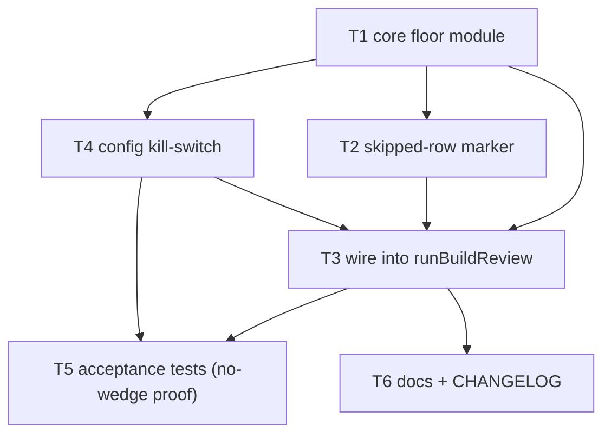

# Implementation Plan — Per-task "work happened at all" floor under build_review

**Stem:** `per-task-work-happened-floor` · Tier M · Track TECHNICAL
**Source:** jstoup111/ai-conductor#781 (follow-up to #773) · ADR: `adr-2026-07-22-per-task-work-happened-floor.md` (APPROVED)

A deterministic, **non-blocking** advisory computed inside the `build_review` step:
each planned task is *covered* by ≥1 `Task:`-trailered commit (canonical fold) OR
*marked* verify-only/skipped; an uncovered, unmarked task is a **gap**, surfaced to a
telemetry artifact + WARNING lines before ship. Never injects into the grader prompt,
never blocks, never uses path/dirname/SHA/pinned-stamp corroboration.

## Task Dependency Graph

---

## Task 1 — Core floor module (compute + render)

Create `per-task-commit-floor.ts` exporting a pure, dependency-injected computation and
a renderer. Signature: `runPerTaskCommitFloor(args: { projectRoot: string; planPath:
string; taskStatusPath?: string }): Promise<PerTaskFloorReport>` where
`PerTaskFloorReport = { satisfied: boolean; gaps: string[]; coveredTasks: string[];
markedTasks: string[]; skipNotes: string[] }`. Compute: plan ids via
`parsePlanTaskPaths(planText).keys()`; covered via `listCommitsWithTrailers(projectRoot)`
Task-trailer values folded through `canonicalTaskId`; marked via
`parsePlanTaskVerifyOnly(planText)` (verify-only half only in this task). A gap = not
covered ∧ not marked. `satisfied = gaps.length === 0`. Fail-soft: any thrown error →
push a `skipNotes` entry, return `satisfied: true`, `gaps: []` (never fabricate a flag).
Add `renderPerTaskFloorReport(report): string[]` emitting one advisory line per gap:
`Advisory: task <id> produced no commit carrying its Task: trailer and no verify-only/
skip marker — confirm its work shipped inside another task's commit or add a
**Verify-only:** marker.`

- **Files:** src/conductor/src/engine/per-task-commit-floor.ts
- **Dependencies:** none

## Task 2 — Honor task-status `skipped` rows as a marker

Extend the module's marker union: a task is also *marked* when `task-status.json` has a
row for it with `status === 'skipped'`. Read via `normalizeTasks` (from
`task-progress.ts`) for tolerant shape handling; resolve `taskStatusPath` default to
`<projectRoot>/.pipeline/task-status.json`. Missing/malformed status file → no skipped
ids (fail-soft, not an error). Fold ids through `canonicalTaskId` so `T6`/`6` match.

- **Files:** src/conductor/src/engine/per-task-commit-floor.ts
- **Dependencies:** 1

## Task 3 — Wire the floor into `runBuildReview` (non-blocking first pass)

In `runBuildReview`, after `assembleBuildReviewInputs` resolves `planPath` and before
(or independently of) the grader dispatch: if the kill-switch (Task 4) is on, call
`runPerTaskCommitFloor`, write the report to `.pipeline/per-task-floor.json` (via
`ensurePipelineDir`), and prepend `renderPerTaskFloorReport` lines to the step's
`output` when gaps exist (also surfaced to daemon.log as WARNING). MUST NOT: modify
`buildGraderPrompt`/its inputs, change `.pipeline/build-review.json`, alter the returned
`success` flag, or trigger a kickback. Floor errors are swallowed to `skipNotes` and
never fail the step.

- **Files:** src/conductor/src/engine/step-runners.ts
- **Dependencies:** 1, 2, 4

## Task 4 — Optional kill-switch `build_review.perTaskFloor` (default on)

Add optional `perTaskFloor?: boolean` to `BuildReviewConfig`; resolve it in
`resolveBuildReviewConfig` to a concrete boolean defaulting to `true` when the block or
field is absent/malformed (mirrors `DEFAULT_BUILD_REVIEW_ENABLED`). Purely additive —
no change to existing field validation.

- **Files:** src/conductor/src/types/config.ts, src/conductor/src/engine/resolved-config.ts
- **Dependencies:** 1

## Task 5 — Acceptance + unit tests (incl. the #773 no-wedge proof)

Cover the stories: (a) zero-commit unmarked task → `satisfied:false`, gap listed,
artifact written, WARNING emitted, verdict/step unchanged; (b) all-covered →
`satisfied:true`, silent; (c) verify-only marker AND `skipped` row → not in gaps;
(d) **folded-work no-wedge**: plan tasks `6,7`, one commit trailered `Task: 7` only,
task 6 unmarked → `6` in gaps (advisory) BUT step NOT blocked / verdict unchanged;
(e) fail-soft: non-repo / missing plan / malformed status → `satisfied:true`, `skipNotes`
non-empty, no throw; (f) kill-switch off → no artifact, no WARNING. Use the project's
existing engine/integration test conventions and a real temp git repo for the trailer
cases.

- **Files:** src/conductor/test/engine/per-task-commit-floor.test.ts, src/conductor/test/integration/per-task-floor.integration.test.ts
- **Dependencies:** 3, 4

## Task 6 — Docs + CHANGELOG

Add a `## [Unreleased]` → `### Added` CHANGELOG entry describing the non-blocking
per-task work-happened advisory floor under build_review (telemetry artifact +
WARNING; trailer-OR-marker signal; no path/SHA corroboration; no wedge). Document the
floor and the `**Verify-only:** yes` / `**Type:** verification` marker escape (and
`task-status` skipped) in `README.md` and `src/conductor/README.md`. Add a short
authoring note to `skills/plan/SKILL.md`: mark a legitimately no-commit task
`**Verify-only:** yes` so the floor won't flag it. No `## Migration` block and no
release-waiver required — the change is internal engine machinery plus an additive,
optional config field and docs; it does not change `bin/conduct CLI`, `hook wiring`,
`skill symlink targets`, or the `settings.json` schema (the four canonical breaking
surfaces). VERSION is left unchanged (pre-v1 lock: CHANGELOG `[Unreleased]` only).

- **Files:** CHANGELOG.md, README.md, src/conductor/README.md, skills/plan/SKILL.md
- **Dependencies:** 3

---

## Validation (before any commit in this repo)

Run `test/test_harness_integrity.sh` (bash syntax, SKILL.md frontmatter, references,
model table, changelog/semver) plus the conductor TS test suite. Fix all failures
before committing. The build_review completeness rubric remains the semantic authority;
this floor is the cheap deterministic first pass beneath it.
