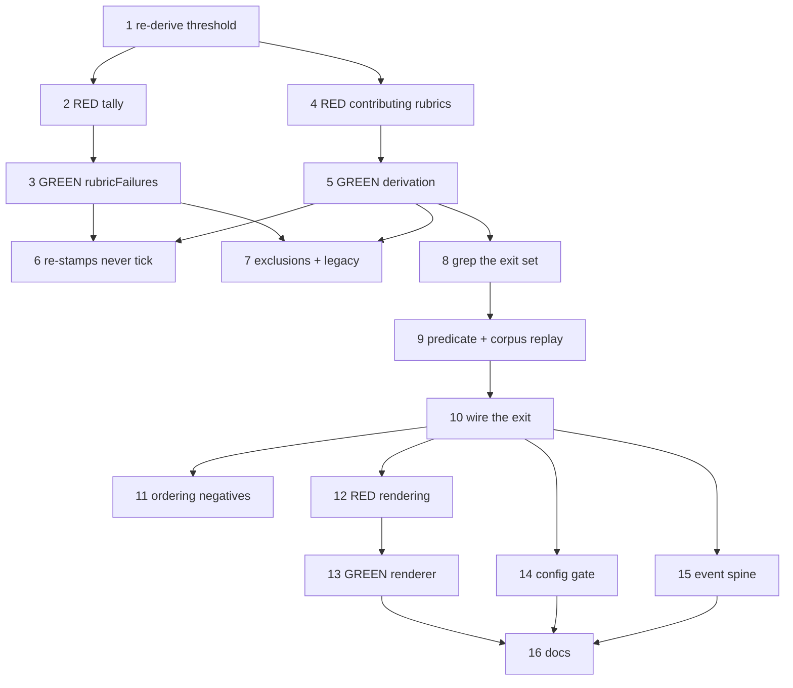

# Implementation Plan: The engine cannot detect its own spinning

**Date:** 2026-08-17
**Design:** .docs/decisions/adr-2026-08-17-build-review-rubric-repetition-short-circuit.md
**Stories:** .docs/stories/the-engine-cannot-detect-its-own-spinning-operator.md
**Stories status:** Accepted; Stories 1–6
**Conflict check:** Clean as of 2026-08-17
**Review conditions:** .docs/decisions/architecture-review-2026-08-17-the-engine-cannot-detect-its-own-spinning-operator.md

## Summary

Sixteen tasks that make `build_review` short-circuit when one rubric keeps failing, and that make
every convergence halt name what repeated instead of echoing a raw grader excerpt. Closes
ai-conductor#1652.

## Technical Approach

**The existing bound is late and largely unreachable.** Reconstructed from persisted event ledgers
across 11 features, five exceeded the cumulative cap's nominal threshold of five kickbacks and the
cap fired on **two of eleven** — `adr-2026-08-12` D2 resets `cumulative` on a `build_review` PASS,
and every long run in the corpus contained at least one. That reset is deliberate and this change
does not touch it.

**The primary change is Tasks 3–6: a per-rubric failure tally on the ledger entry, ticked on
consumption.** `KickbackGateEntry` gains `rubricFailures` beside `count` and `cumulative`. Each
consumed kickback increments the tally for every rubric that contributed an unresolved finding to
*this* lap's effective verdict. `count`'s `madeProgress` rule, `cumulative`'s semantics and PASS
reset, and `matchesBuildReviewDisposition` are **not** touched.

**Why the rubric and not the site.** An earlier draft keyed a per-site tally on the typed anchor
subject. Replayed over the same 11 features it fired on **2 of the 5** that spun and missed
`finish-publication` — the episode #1652 reports, which ran nine kickbacks with a maximum site repeat
of two. Sites move as remediation fixes them. Per-rubric at threshold 4 fires on 5 of 5 spinning
features and 0 of 6 healthy ones, avoiding 14 kickbacks. The rubric name is engine-supplied from the
registry, so `adr-2026-07-26` D3's finding that grader text is never byte-stable cannot touch it, and
nothing about finding identity or `adr-2026-08-16`'s vocabularies is read or affected.

**Why not a lap scan** — the intake's central hypothesis. `adr-2026-08-13` D7 stamps a cache hit's
prior result into the current lap's artifact and D2 makes the lap id an input digest rather than a
chronology; a provenance census found 36 of 44 rubric artifacts on the incident feature were
re-stamps. Task 6's negative test pins this permanently. `adr-2026-08-12` independently forbids the
shape ("state belongs in the state file; the event is the observation of it").

**Why no LLM and no wall-clock window.** `adr-2026-08-12`'s consequences record "no LLM is in the
bound's decision path" as a preserved property; a rate trigger is forbidden by
`adr-2026-07-10-intra-step-build-progress-events` and is not reproducible run-to-run. Both are
recorded as rejected in the ADR so they are not re-proposed.

**Ordering is the highest-risk part of the diff.** Three APPROVED decisions constrain it: the
fresh-base disposition runs first (`adr-2026-07-23`), cap-first is preserved (`adr-2026-07-27` F3,
`adr-2026-08-16` D6), and the exit set must be **grep-derived at implementation time** rather than
taken from this plan's count (`adr-2026-08-16` D6, review condition C1). Task 8 does that derivation
before Task 10 adds the exit.

**Sequencing.** Task 1 re-derives the threshold in-tree from the corpus so the number is measured
rather than inherited. Tasks 2–7 build the tally; 8–11 add the exit in the right place; 12–13 render
the diagnosis on both halt paths; 14 gates it; 15 puts it on the spine; 16 updates the docs.

**Expect no new provider dispatch, no new store, no new file, and no new event variant.** Any of
those in the diff means the implementation drifted back toward a withdrawn design.

## Prerequisites

- None. No migration, dependency, or external account. The ledger's read tolerance makes an
  in-flight feature's legacy entry load clean, so there is no data migration.

## Tasks

### Task 1: Re-derive the threshold from the persisted corpus
**Story:** 5
**Type:** infrastructure
**Verify-only:** yes

**Steps:**
1. Reconstruct each feature's consumed-kickback sequence and the rubrics contributing unresolved
   findings at each, from the aggregates embedded in `step_failed` events across
   `.daemon/evals-raw/features/*/events.jsonl` and the live worktrees.
2. Label each feature spin or healthy from its operator report and cap termination, and sweep
   per-rubric thresholds 3 through 6, recording fires-on-spin, fires-on-healthy, and kickbacks
   avoided.
3. Re-run the sweep with and without the PASS reset and confirm the results are identical, which is
   what licenses Story 1 leaving `adr-2026-08-12` D2 untouched.
4. Record the table and the selected threshold in the commit message; if the corpus no longer
   separates cleanly at any threshold, stop and halt for the operator rather than shipping a number
   the data does not support.
5. Commit an empty commit carrying `Evidence: skipped establishes findings only`.

**Files likely touched:**
- none

**Dependencies:** none

---

### Task 2: RED — a rubric's tally advances once per consumed kickback
**Story:** 1
**Type:** happy-path

**Steps:**
1. Write a failing test asserting that bumping a gate with one contributing rubric increments that
   rubric's tally to 1, and that four such bumps reach 4.
2. Add a failing test asserting a rubric contributing on kickbacks 1 and 3 but not 2 reaches 2 — the
   count is cumulative, not a consecutive run.
3. Add a failing test asserting `count` and `cumulative` keep their existing values and semantics
   across the same bumps.
4. Add a failing test asserting a `build_review` PASS clears the tally alongside `cumulative`.
5. Verify RED.
6. Commit: "test(kickback-ledger): per-rubric failure tally advances on consumption".

**Files likely touched:**
- `src/conductor/test/engine/kickback-ledger.test.ts` — advance, non-consecutive, isolation, reset

**Dependencies:** Task 1

---

### Task 3: GREEN — `rubricFailures` on the gate entry
**Story:** 1
**Type:** happy-path

**Steps:**
1. Add `rubricFailures: Record<string, number>` to `KickbackGateEntry` and to the persisted shape.
2. Extend `BumpKickbackGateInput` with the lap's contributing rubrics and increment each in
   `bumpKickbackGate`, leaving `madeProgress`, `count`, and `cumulative` untouched.
3. Clear the tally wherever `cumulative` is reset on PASS.
4. Verify Task 2's tests pass.
5. Commit: "feat(kickback-ledger): per-rubric failure tally (adr-2026-08-17)".

**Files likely touched:**
- `src/conductor/src/engine/kickback-ledger.ts` — entry shape, bump, reset

**Dependencies:** Task 2

---

### Task 4: RED — contributing rubrics come from the current lap's effective verdict
**Story:** 2
**Type:** happy-path

**Steps:**
1. Write a failing test asserting the contributing-rubric set is derived from
   `resolveEffectiveBuildReviewVerdict`'s unresolved findings, exhaustive over the rubric registry
   rather than a hardcoded list.
2. Add a failing test asserting two laps whose findings differ entirely in wording, sites, and
   concern kinds still both count toward the same rubric.
3. Add a structural test asserting no grader-authored field — `concernKind`, any anchor field,
   `summary`, `evidenceLocations` — is read by the counting path.
4. Verify RED.
5. Commit: "test(build-review): contributing rubrics derive from the effective verdict".

**Files likely touched:**
- `src/conductor/test/engine/build-review-repetition.test.ts` — new

**Dependencies:** Task 1

---

### Task 5: GREEN — a pure contributing-rubric derivation
**Story:** 2
**Type:** happy-path

**Steps:**
1. Add `contributingRubrics(aggregate, effectiveVerdict)` as a pure function with no I/O, driven by
   the rubric registry.
2. Exclude rubrics whose findings are all accepted, and rubrics that settled as infrastructure
   failures rather than judged FAILs.
3. Verify Task 4's tests pass.
4. Commit: "feat(build-review): derive the rubrics a lap's unresolved findings came from".

**Files likely touched:**
- `src/conductor/src/engine/build-review-repetition.ts` — new module

**Dependencies:** Task 4

---

### Task 6: RED+GREEN — cache re-stamps and lap globs never advance the tally
**Story:** 2
**Type:** negative-path

**Steps:**
1. Write a failing test in which repeated laps produce only `provenance.kind: 'cache-hit'` artifacts
   and assert the tally stays empty — a tick is one consumed kickback, never one artifact.
2. Add a structural test asserting no engine module enumerates `.pipeline/build-review/lap-*` to
   derive repeat counts.
3. Add a test asserting the tally is never read by identity, disposition, or immunity paths.
4. Verify RED, then confirm GREEN against Tasks 3 and 5 without new production code.
5. Commit: "test(build-review): cache re-stamps do not advance the repetition tally".

**Files likely touched:**
- `src/conductor/test/engine/build-review-repetition.test.ts` — re-stamp case
- `src/conductor/test/structural/no-lap-glob-counting.test.ts` — new

**Dependencies:** Task 3, Task 5

---

### Task 7: RED+GREEN — accepted findings, infrastructure failures, legacy entries
**Story:** 1
**Type:** negative-path

**Steps:**
1. Write a failing test asserting a rubric whose findings are all operator-accepted does not tick.
2. Add a failing test asserting a rubric that settled as an infrastructure failure does not tick.
3. Add a failing test asserting a ledger entry written without `rubricFailures` loads clean and
   yields an empty tally, mirroring the existing legacy-`cumulative` coverage (review condition C4).
4. Verify RED, then implement the tolerance in the ledger.
5. Commit: "fix(kickback-ledger): legacy tolerance and non-semantic exclusions for the tally".

**Files likely touched:**
- `src/conductor/src/engine/kickback-ledger.ts` — `isKickbackGateEntry`
- `src/conductor/src/engine/build-review-repetition.ts` — exclusions
- `src/conductor/test/engine/kickback-ledger.test.ts` — legacy and exclusion cases

**Dependencies:** Task 3, Task 5

---

### Task 8: Derive the FAIL block's exit set from the tree
**Story:** 3
**Type:** infrastructure
**Verify-only:** yes

**Steps:**
1. Grep `conductor.ts`'s `build_review` FAIL block for every terminal exit and every kickback route,
   at the tree being edited rather than from this plan's or the ADR's count.
2. Confirm each exit consults the effective-verdict predicate at the exit rather than a hoisted
   value, per `adr-2026-08-16` D6 and review condition C1.
3. Record the derived exit set and the intended insertion point in the commit message.
4. Commit an empty commit carrying `Evidence: skipped establishes findings only`.

**Files likely touched:**
- none

**Dependencies:** Task 5

---

### Task 9: RED+GREEN — the short-circuit predicate
**Story:** 3
**Type:** happy-path

**Steps:**
1. Write a failing test asserting the predicate returns a halt decision when any rubric's tally
   reaches the configured threshold, and none when every rubric is below it.
2. Add a failing test replaying the historical corpus sequences and asserting every labelled spin
   feature halts and no healthy feature does.
3. Verify RED, then implement the predicate as a pure function over the ledger entry and threshold,
   mirroring `classifyBuildProgress` / `shouldEscalateKickback`.
4. Commit: "feat(build-review): short-circuit predicate for a repeatedly-failing rubric".

**Files likely touched:**
- `src/conductor/src/engine/build-review-repetition.ts` — predicate
- `src/conductor/test/engine/build-review-repetition.test.ts` — predicate and corpus-replay cases

**Dependencies:** Task 8

---

### Task 10: GREEN — wire the exit in, after the cap
**Story:** 3
**Type:** happy-path

**Steps:**
1. Pass the lap's contributing rubrics into `consumeKickbackBudget`'s bump input, sourced from the
   effective verdict resolved at that exit.
2. Insert the short-circuit exit after the fresh-base disposition, after the D2 escalation, after
   budget consumption, and after the cumulative-cap check, at the point Task 8 derived.
3. Give the halt a reason string distinct from every other exit's, and class `needs-human`.
4. Reuse the exact sequence beside it: `writeHaltMarker` with its result consumed and a failed write
   logged, then `surfaceRemediationPr`, then `emitLoopHalt` (review condition C2).
5. Commit: "feat(build_review): short-circuit on a repeatedly-failing rubric".

**Files likely touched:**
- `src/conductor/src/engine/conductor.ts` — FAIL block exit and bump input

**Dependencies:** Task 9

---

### Task 11: RED+GREEN — ordering negative paths
**Story:** 3
**Type:** negative-path

**Steps:**
1. Write a failing test asserting that when the cumulative cap is also exceeded on the same lap, the
   cap halt wins and keeps its own distinct reason.
2. Add a failing test asserting a lap discarded by the fresh-base disposition ticks nothing and
   cannot reach the short-circuit.
3. Add a failing test asserting a lap whose findings are all accepted resolves to PASS, consumes no
   kickback, and takes no halt.
4. Add a failing test asserting the halt is classified so the re-kick sweep skips it on every pass.
5. Verify RED, then GREEN against Task 10.
6. Commit: "test(build_review): short-circuit ordering and precedence".

**Files likely touched:**
- `src/conductor/test/integration/build-review-short-circuit.test.ts` — new

**Dependencies:** Task 10

---

### Task 12: RED — both convergence halts name what repeated
**Story:** 4
**Type:** happy-path

**Steps:**
1. Write a failing test asserting the short-circuit halt body names the rubric, its failure count,
   the sites that rubric most recently flagged, and the cumulative budget state.
2. Add a failing test asserting the **existing cumulative-cap halt** body carries the same rendered
   table alongside its own distinct reason.
3. Add a failing test asserting an empty tally degrades the cap halt to its existing reason rather
   than rendering an empty table.
4. Add a failing test asserting the rendered sites are reported only and never counted.
5. Verify RED.
6. Commit: "test(build_review): convergence halts render the repetition table".

**Files likely touched:**
- `src/conductor/test/engine/build-review-repetition.test.ts` — rendering cases

**Dependencies:** Task 10

---

### Task 13: GREEN — the renderer, bounded and evidence-only
**Story:** 4
**Type:** happy-path

**Steps:**
1. Implement rendering as a pure function over the ledger entry and the lap's findings, returning
   prose to the existing halt-marker call sites.
2. Bound the table so long site names cannot bloat the marker.
3. Assert by test that the body states only observed counts and never that the run is spinning or
   cannot converge (review condition C5).
4. Verify Task 12's tests pass.
5. Commit: "feat(build_review): render what repeated into both convergence halts".

**Files likely touched:**
- `src/conductor/src/engine/build-review-repetition.ts` — renderer
- `src/conductor/src/engine/conductor.ts` — cap-halt body composition

**Dependencies:** Task 12

---

### Task 14: RED+GREEN — the config gate
**Story:** 5
**Type:** negative-path

**Steps:**
1. Write a failing test asserting an absent config block resolves enabled at the default threshold.
2. Add a failing test asserting `enabled: false` is byte-identical to pre-change behaviour — no
   tally consulted, halt path unreachable.
3. Add a failing test asserting a non-positive-integer or out-of-range threshold fails config
   validation with an error naming the key.
4. Verify RED, then add the block to the config type, the resolver, and the validator.
5. Commit: "feat(config): build_review rubric-repetition bound, default on, fail-closed".

**Files likely touched:**
- `src/conductor/src/types/config.ts` — config block
- `src/conductor/src/engine/config.ts` — defaults and validation
- `src/conductor/test/engine/config.test.ts` — resolution and rejection cases

**Dependencies:** Task 10

---

### Task 15: RED+GREEN — the signal rides the event spine
**Story:** 6
**Type:** happy-path

**Steps:**
1. Write a failing test asserting the `kickback` event carries the rubric tallies as an additive
   optional field, absent when nothing ticked.
2. Add a failing test asserting the persisted ledger alone is sufficient to reconstruct which rubrics
   repeated and how often.
3. Verify RED, then add the optional field to the existing `kickback` member and an explicit
   persisting entry in the event sink registry (review condition C3).
4. Confirm no new event variant was introduced and the halt rides the central emit path.
5. Commit: "feat(events): carry rubric failure tallies on the kickback event".

**Files likely touched:**
- `src/conductor/src/types/events.ts` — additive field on `kickback`
- `src/conductor/src/engine/event-sinks.ts` — explicit sink decision
- `src/conductor/test/engine/event-sinks.test.ts` — registry and reconstruction cases

**Dependencies:** Task 10

---

### Task 16: Documentation
**Story:** 5
**Type:** infrastructure

**Steps:**
1. Document the bound, its threshold, its default, and the corpus evidence behind the number in the
   configuration reference beside the cumulative bound's key.
2. Document the new halt and the rendered repetition table in the gates explanation.
3. Add the halt's recovery to the stalled-or-stuck runbook, and note its adjacency to that page's
   recorded limitation that `--report` renders neither halt nor kickback tables.
4. Commit: "docs: build_review rubric-repetition short-circuit".

**Files likely touched:**
- `docs/reference/configuration.md`
- `docs/explanation/gates.md`
- `docs/runbooks/stalled-or-stuck-feature.md`

**Dependencies:** Task 13, Task 14, Task 15

---

## Task Dependency Graph

## Risks

- **Corpus size.** The threshold separates perfectly over 11 features, but the spin/healthy labelling
  rests on operator reports and cap terminations rather than an independent oracle. Task 1 re-derives
  it in-tree and is instructed to halt rather than ship a number the data stops supporting; Task 14's
  gate is the production escape.
- **Coarseness is deliberate.** The bound names a rubric, not a defect, so the operator still rules on
  substance. An implementation that makes the tally finer — per finding, per site, per anchor —
  reintroduces the key that measured 2 of 5 and must fail review.
- **Ordering drift.** Task 8 exists because `adr-2026-08-16` D6 requires the exit set be derived from
  the tree, not from a document. Inserting the exit before the cap masks the ping-pong reason;
  inserting it before the fresh-base disposition counts findings the engine has already invalidated.
- **The cap's PASS reset is untouched but adjacent.** The Context measurement shows `cumulative` fires
  on 2 of 11 features because one PASS clears it. This plan does not change that; if the operator
  wants a never-reset floor on `cumulative`, it belongs to `adr-2026-08-12`, not here.
