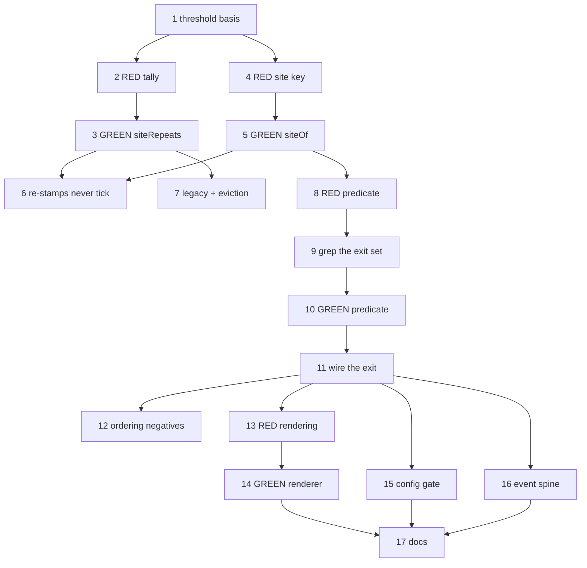

# Implementation Plan: The engine cannot detect its own spinning

**Date:** 2026-08-17
**Design:** .docs/decisions/adr-2026-08-17-build-review-site-repetition-short-circuit.md
**Stories:** .docs/stories/the-engine-cannot-detect-its-own-spinning-operator.md
**Stories status:** Accepted; Stories 1–6
**Conflict check:** Clean as of 2026-08-17
**Review conditions:** .docs/decisions/architecture-review-2026-08-17-the-engine-cannot-detect-its-own-spinning-operator.md

## Summary

Seventeen tasks that make `build_review` short-circuit when one unresolved site keeps failing, and
that make every convergence halt name what repeated instead of echoing a raw grader excerpt. Closes
ai-conductor#1652.

## Technical Approach

**The bound is not missing; it is late and mute.** `adr-2026-08-12` is APPROVED, implemented, and
enabled by default, and it terminated the 2026-08-16 incident at `cumulative 6, cap 5`. Two things
are wrong with that termination: it arrives after roughly two hours of dispatches, and its body is
`lastReason` — a rubric and a concern kind, never the site an operator has to rule on. The feature is
"trip earlier on the right signal, and say what you saw", not "add a convergence bound".

**The primary change is Tasks 3–7: a per-site tally on the ledger entry, ticked on consumption.**
`KickbackGateEntry` gains a bounded `siteRepeats` record beside `count` and `cumulative`. Each
consumed kickback increments the sites named by findings that are unresolved in *this* lap's
effective verdict. `count`'s `madeProgress` rule, `cumulative`'s semantics, and
`matchesBuildReviewDisposition` are **not** touched.

**Why not a lap scan** — the intake's central hypothesis. `adr-2026-08-13` D7 stamps a cache hit's
prior result into the current lap's artifact, and D2 makes the lap id an input digest rather than a
chronology. A provenance census over the two features with laps on disk found 36 of 44 rubric
artifacts on the incident feature, and 20 of 20 on the other, were re-stamps; the apparent 8-of-11
repeat signal was one judgement counted eight times. Task 6's negative test pins this permanently.
`adr-2026-08-12` independently forbids the shape ("state belongs in the state file; the event is the
observation of it").

**Why not `evidenceLocations`** — an earlier draft's key, chosen because that same contaminated
measurement made it look strong. `adr-2026-08-13-stable-build-review-finding-dispositions` classes it
as presentation and `adr-2026-08-16`'s engine-verified reference list excludes it. Task 4 keys on the
typed anchor subject instead.

**Why no LLM and no wall-clock window.** `adr-2026-08-12`'s consequences record "no LLM is in the
bound's decision path" as a preserved property; a rate trigger is forbidden by
`adr-2026-07-10-intra-step-build-progress-events`, which confines the engine's only time-based
threshold to observability, and is not reproducible run-to-run. Both are recorded as rejected in the
ADR so they are not re-proposed.

**Ordering is the highest-risk part of the diff.** Three APPROVED decisions constrain it: the
fresh-base disposition runs first (`adr-2026-07-23`), cap-first is preserved (`adr-2026-07-27` F3,
`adr-2026-08-16` D6), and the exit set must be **grep-derived at implementation time** rather than
taken from this plan's count (`adr-2026-08-16` D6, review condition C1). Task 9 does that derivation
before Task 11 adds the exit.

**Sequencing.** Task 1 discharges the review's threshold risk before anything depends on the number.
Tasks 2–7 build the tally; 8–12 add the exit in the right place; 13–14 render the diagnosis on both
halt paths; 15 gates it; 16 puts it on the spine; 17 updates the docs.

**Expect no new provider dispatch, no new store, no new file, and no new event variant.** Any of
those in the diff means the implementation drifted back toward a withdrawn design.

## Prerequisites

- None. No migration, dependency, or external account. The ledger's read tolerance makes an
  in-flight feature's legacy entry load clean, so there is no data migration.

## Tasks

### Task 1: Fix the threshold and record its evidence basis
**Story:** 5
**Type:** infrastructure
**Verify-only:** yes

**Steps:**
1. Census `provenance.kind` across every `.pipeline/build-review/lap-*/<rubric>.json` on disk;
   record fresh-judgement counts per feature.
2. Confirm the corpus cannot calibrate the threshold, and record the ADR's default of 3 with its
   55% confidence and its basis in the commit message.
3. Record the ADR's exit condition — re-derive from ten features that reached three or more consumed
   `build_review` kickbacks — as the condition under which the default is revisited.
4. Commit an empty commit carrying `Evidence: skipped establishes findings only`.

**Files likely touched:**
- none

**Dependencies:** none

---

### Task 2: RED — a site's tally advances once per consumed kickback
**Story:** 1
**Type:** happy-path

**Steps:**
1. Write a failing test asserting that bumping a gate with one unresolved site increments that
   site's tally to 1, and that three consecutive bumps reach 3.
2. Add a failing test asserting `count` and `cumulative` keep their existing values and semantics
   across the same bumps.
3. Add a failing test asserting a `build_review` PASS clears the tally alongside `cumulative`.
4. Verify RED.
5. Commit: "test(kickback-ledger): per-site repetition tally advances on consumption".

**Files likely touched:**
- `src/conductor/test/engine/kickback-ledger.test.ts` — tally advance, isolation, reset

**Dependencies:** Task 1

---

### Task 3: GREEN — `siteRepeats` on the gate entry
**Story:** 1
**Type:** happy-path

**Steps:**
1. Add `siteRepeats: Record<string, number>` to `KickbackGateEntry` and to the persisted shape.
2. Extend `BumpKickbackGateInput` with the lap's unresolved sites and increment each in
   `bumpKickbackGate`, leaving `madeProgress`, `count`, and `cumulative` untouched.
3. Clear the tally wherever `cumulative` is reset on PASS.
4. Verify Task 2's tests pass.
5. Commit: "feat(kickback-ledger): per-site repetition tally (adr-2026-08-17)".

**Files likely touched:**
- `src/conductor/src/engine/kickback-ledger.ts` — entry shape, bump, reset

**Dependencies:** Task 2

---

### Task 4: RED — the site key is the typed anchor subject
**Story:** 2
**Type:** happy-path

**Steps:**
1. Write a failing test asserting `siteOf` returns `anchor.path` for scope, `anchor.changedTest` for
   tautology, `anchor.locus` for rootCause, and `anchor.planTask` for completeness.
2. Add a failing test asserting two findings differing only in `summary`, `evidenceLocations`, or a
   prose subject resolve to the same site.
3. Add a failing test asserting a finding with an absent or empty anchor subject is skipped, not
   counted under a placeholder.
4. Verify RED.
5. Commit: "test(build-review): site derivation uses the typed anchor subject".

**Files likely touched:**
- `src/conductor/test/engine/build-review-site.test.ts` — new; exhaustive over four rubrics

**Dependencies:** Task 1

---

### Task 5: GREEN — a pure, exhaustive site derivation
**Story:** 2
**Type:** happy-path

**Steps:**
1. Add `siteOf(finding)` as a pure function with no I/O, exhaustive over the four rubric anchor arms.
2. Return undefined for an absent or empty subject so callers skip rather than bucket.
3. Verify Task 4's tests pass.
4. Commit: "feat(build-review): derive a finding's site from its typed anchor".

**Files likely touched:**
- `src/conductor/src/engine/build-review-site.ts` — new module

**Dependencies:** Task 4

---

### Task 6: RED+GREEN — cache re-stamps and lap globs never advance the tally
**Story:** 2
**Type:** negative-path

**Steps:**
1. Write a failing test in which repeated laps produce only `provenance.kind: 'cache-hit'` artifacts
   and assert the tally stays empty — a tick is one consumed kickback, never one artifact.
2. Add a structural test asserting no engine module enumerates `.pipeline/build-review/lap-*` to
   derive repeat counts.
3. Verify RED, then confirm GREEN against Tasks 3 and 5 without new production code.
4. Commit: "test(build-review): cache re-stamps do not advance the repetition tally".

**Files likely touched:**
- `src/conductor/test/engine/build-review-site.test.ts` — re-stamp case
- `src/conductor/test/structural/no-lap-glob-counting.test.ts` — new

**Dependencies:** Task 3, Task 5

---

### Task 7: RED+GREEN — accepted findings and legacy entries
**Story:** 1
**Type:** negative-path

**Steps:**
1. Write a failing test asserting a finding carrying an accepted operator disposition does not tick
   its site.
2. Add a failing test asserting a ledger entry written without `siteRepeats` loads clean and yields
   an empty tally, mirroring the existing legacy-`cumulative` coverage (review condition C4).
3. Add a failing test asserting the tally caps at its fixed capacity and evicts the lowest count,
   ties by insertion order.
4. Verify RED, then implement the tolerance and eviction in the ledger.
5. Commit: "fix(kickback-ledger): legacy tolerance and bounded eviction for the site tally".

**Files likely touched:**
- `src/conductor/src/engine/kickback-ledger.ts` — `isKickbackGateEntry`, eviction
- `src/conductor/test/engine/kickback-ledger.test.ts` — legacy, capacity, accepted-finding cases

**Dependencies:** Task 3

---

### Task 8: RED — the short-circuit predicate
**Story:** 3
**Type:** happy-path

**Steps:**
1. Write a failing test asserting the predicate returns a halt decision when any site's tally
   reaches the configured threshold.
2. Add a failing test asserting it returns no halt when findings spread across sites with none
   reaching the threshold.
3. Verify RED.
4. Commit: "test(build-review): site-repetition short-circuit predicate".

**Files likely touched:**
- `src/conductor/test/engine/build-review-site.test.ts` — predicate cases

**Dependencies:** Task 5

---

### Task 9: Derive the FAIL block's exit set from the tree
**Story:** 3
**Type:** infrastructure
**Verify-only:** yes

**Steps:**
1. Grep `conductor.ts`'s `build_review` FAIL block for every terminal exit and every kickback route,
   at the tree being edited rather than from this plan's or the ADR's count.
2. Confirm each exit consults the effective-verdict predicate at the exit rather than a hoisted
   value, per `adr-2026-08-16` D6 and review condition C1.
3. Record the derived exit set and the intended insertion point in the commit message.
4. Commit an empty commit carrying `Evidence: skipped establishes findings only`.

**Files likely touched:**
- none

**Dependencies:** Task 8

---

### Task 10: GREEN — the predicate, pure and config-aware
**Story:** 3
**Type:** happy-path

**Steps:**
1. Implement the short-circuit predicate over the ledger entry and the resolved threshold, with no
   I/O, mirroring `classifyBuildProgress` / `shouldEscalateKickback`.
2. Verify Task 8's tests pass.
3. Commit: "feat(build-review): short-circuit predicate for a repeated unresolved site".

**Files likely touched:**
- `src/conductor/src/engine/build-review-site.ts` — predicate

**Dependencies:** Task 9

---

### Task 11: GREEN — wire the exit in, after the cap
**Story:** 3
**Type:** happy-path

**Steps:**
1. Pass the lap's unresolved sites into `consumeKickbackBudget`'s bump input, sourced from the
   effective verdict resolved at that exit.
2. Insert the short-circuit exit after the fresh-base disposition, after the D2 escalation, after
   budget consumption, and after the cumulative-cap check, at the point Task 9 derived.
3. Give the halt a reason string distinct from every other exit's, and class `needs-human`.
4. Reuse the exact sequence beside it: `writeHaltMarker` with its result consumed and a failed write
   logged, then `surfaceRemediationPr`, then `emitLoopHalt` (review condition C2).
5. Commit: "feat(build_review): short-circuit on a repeated unresolved site".

**Files likely touched:**
- `src/conductor/src/engine/conductor.ts` — FAIL block exit and bump input

**Dependencies:** Task 10

---

### Task 12: RED+GREEN — ordering negative paths
**Story:** 3
**Type:** negative-path

**Steps:**
1. Write a failing test asserting that when the cumulative cap is also exceeded on the same lap, the
   cap halt wins and keeps its own distinct reason.
2. Add a failing test asserting a lap discarded by the fresh-base disposition ticks nothing and
   cannot reach the short-circuit.
3. Add a failing test asserting a lap whose findings are all accepted resolves to PASS, consumes no
   kickback, and takes no halt.
4. Add a failing test asserting the halt is classified so the re-kick sweep skips it on every pass.
5. Verify RED, then GREEN against Task 11.
6. Commit: "test(build_review): short-circuit ordering and precedence".

**Files likely touched:**
- `src/conductor/test/integration/build-review-short-circuit.test.ts` — new

**Dependencies:** Task 11

---

### Task 13: RED — both convergence halts name what repeated
**Story:** 4
**Type:** happy-path

**Steps:**
1. Write a failing test asserting the short-circuit halt body names the site, its repeat count, the
   raising rubrics, and the cumulative budget state.
2. Add a failing test asserting the **existing cumulative-cap halt** body carries the same rendered
   table alongside its own distinct reason.
3. Add a failing test asserting an empty tally degrades the cap halt to its existing reason rather
   than rendering an empty table.
4. Verify RED.
5. Commit: "test(build_review): convergence halts render the repetition table".

**Files likely touched:**
- `src/conductor/test/engine/build-review-site.test.ts` — rendering cases

**Dependencies:** Task 11

---

### Task 14: GREEN — the renderer, bounded and evidence-only
**Story:** 4
**Type:** happy-path

**Steps:**
1. Implement rendering as a pure function over the ledger entry and the lap's findings, returning
   prose to the existing halt-marker call sites.
2. Bound the table so a long site name cannot bloat the marker.
3. Assert by test that the body states only observed repeat counts and never that the run is
   spinning or cannot converge (review condition C5).
4. Verify Task 13's tests pass.
5. Commit: "feat(build_review): render what repeated into both convergence halts".

**Files likely touched:**
- `src/conductor/src/engine/build-review-site.ts` — renderer
- `src/conductor/src/engine/conductor.ts` — cap-halt body composition

**Dependencies:** Task 13

---

### Task 15: RED+GREEN — the config gate
**Story:** 5
**Type:** negative-path

**Steps:**
1. Write a failing test asserting an absent config block resolves enabled at the default threshold.
2. Add a failing test asserting `enabled: false` is byte-identical to pre-change behaviour — no
   tally consulted, halt path unreachable.
3. Add a failing test asserting a non-positive-integer or out-of-range threshold fails config
   validation with an error naming the key.
4. Verify RED, then add the block to the config type, the resolver, and the validator.
5. Commit: "feat(config): build_review site-repetition bound, default on, fail-closed".

**Files likely touched:**
- `src/conductor/src/types/config.ts` — config block
- `src/conductor/src/engine/config.ts` — defaults and validation
- `src/conductor/test/engine/config.test.ts` — resolution and rejection cases

**Dependencies:** Task 11

---

### Task 16: RED+GREEN — the signal rides the event spine
**Story:** 6
**Type:** happy-path

**Steps:**
1. Write a failing test asserting the `kickback` event carries the sites that ticked and their
   counts as an additive optional field, absent when nothing ticked.
2. Add a failing test asserting the persisted ledger alone is sufficient to reconstruct which sites
   repeated and how often.
3. Verify RED, then add the optional field to the existing `kickback` member and an explicit
   persisting entry in the event sink registry (review condition C3).
4. Confirm no new event variant was introduced and the halt rides the central emit path.
5. Commit: "feat(events): carry repeated sites on the kickback event".

**Files likely touched:**
- `src/conductor/src/types/events.ts` — additive field on `kickback`
- `src/conductor/src/engine/event-sinks.ts` — explicit sink decision
- `src/conductor/test/engine/event-sinks.test.ts` — registry and reconstruction cases

**Dependencies:** Task 11

---

### Task 17: Documentation
**Story:** 5
**Type:** infrastructure

**Steps:**
1. Document the bound, its threshold, its default, and its exit condition in the configuration
   reference beside the cumulative bound's key.
2. Document the new halt and the rendered repetition table in the gates explanation.
3. Add the halt's recovery to the stalled-or-stuck runbook, and note its adjacency to that page's
   recorded limitation that `--report` renders neither halt nor kickback tables.
4. Commit: "docs: build_review site-repetition short-circuit".

**Files likely touched:**
- `docs/reference/configuration.md`
- `docs/explanation/gates.md`
- `docs/runbooks/stalled-or-stuck-feature.md`

**Dependencies:** Task 14, Task 15, Task 16

---

## Task Dependency Graph

## Risks

- **The threshold is a 55%-confidence judgement** and the corpus that would calibrate it does not
  exist. Task 15 is the mitigation the architecture review names as load-bearing, and Task 16 is
  what makes the ADR's exit condition reachable. Neither is optional polish.
- **Site collapse.** The key is coarser than finding identity, so two different findings at one site
  count as one repeat. Licensed only because the consequence is a conservative human-required halt
  rather than silent over-acceptance. An implementation that lets this key touch identity,
  dispositions, or any immunity decision breaks that argument and must fail review.
- **Ordering drift.** Task 9 exists because `adr-2026-08-16` D6 requires the exit set be derived from
  the tree, not from a document. Inserting the exit before the cap masks the ping-pong reason;
  inserting it before the fresh-base disposition counts findings the engine has already invalidated.
- **The bound may never fire** if spins distribute across sites rather than concentrating. That is
  not a failure — Task 14 delivers outcome-2 on the cap path regardless — but Task 16's telemetry
  must distinguish "never fired" from "fired correctly".
