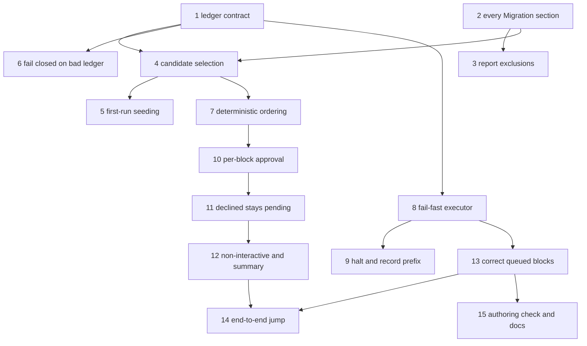

# Implementation Plan: Safe multi-version harness migration

**Date:** 2026-08-03
**Design:** .docs/specs/2026-08-03-safe-multi-version-migration.md
**Architecture:** .docs/decisions/adr-2026-08-03-ledgered-per-block-migration-execution.md
**Stories:** .docs/stories/verify-bin-migrate-handles-a-multi-version-jump-wi.md
**Conflict check:** Clean as of 2026-08-03
**Source:** jstoup111/ai-conductor#219

## Summary

Rework `bin/migrate` from a version-range batch runner into a ledgered, per-block, fail-fast runner
in 15 scoped TDD tasks; correct the four unsafe blocks already queued in the tagged `## [0.99.20]`
changelog entry; and give the runner its first test coverage, including an end-to-end scratch
consumer that performs the real 0.99.17-era jump.

## Technical Approach

- Keep `bin/migrate` a Bash script with an embedded Python parser. No TypeScript, no new dependency.
- Introduce one durable per-consumer-project ledger. Block identity is the release label plus a
  content hash of the block body, so it survives changelog re-rendering.
- Candidate selection is parsed-blocks minus applied-blocks. The version range remains only as an
  advisory display bound and as the first-run seed boundary.
- Execute exactly one block per shell invocation, started with `set -euo pipefail`, with
  `HARNESS_DIR` exported and the consumer project as the working directory.
- Record an outcome after every block, so any interruption leaves a representable applied-prefix and
  pending-suffix.
- Tests reuse the scratch-repo and isolated-home fixtures already established by
  `test/test_bin_update.sh`. No test may stub `bin/migrate` — that stub is the defect this feature
  exists to remove.

## Prerequisites

- Rebase onto current `main` before Task 1.
- Task 1 pins the ledger location and identity scheme before anything reads or writes that state.
- The changelog correction in Task 12 is confined to block bodies inside `## [0.99.20]`. Touching
  `VERSION`, `[Unreleased]`, or release metadata is out of contract and must fail review.
- The PR body must declare its release disposition. Because the change alters the consumer update
  path, the release gate will classify a breaking surface; the PR must carry either a runnable
  migration block or a waiver under `.docs/release-waivers/`, in the same diff, as that gate
  determines.
- No new package, service, schema, port, or credential is required.

## Tasks

### Task 1: Pin the applied-block ledger contract

**Story:** Story 1 — ledger identity and durability
**Type:** infrastructure

**Steps:**
1. Write failing tests that require a documented ledger path, a JSON schema with a version field and
   a per-block record, and an identity function over release label plus block body.
2. Verify RED on the missing helpers.
3. Implement the ledger read, write, and identity helpers in `bin/migrate` as shell functions with a
   small Python helper for JSON and hashing.
4. Verify GREEN with the new unit-level shell tests only.
5. Commit `feat(migrate): pin applied-block ledger contract`.

**Files:**
- `bin/migrate` — ledger path resolution, read, write, identity helpers
- `test/test_bin_migrate_ledger.sh` — schema, identity stability, path resolution

**Wired-into:** bin/migrate#run_project_migrations
**Dependencies:** none

### Task 2: Collect every Migration section in a release entry

**Story:** Story 2 — multiple Migration sections contribute
**Type:** happy-path

**Steps:**
1. Add failing parser cases for a release entry with two `## Migration` sections and for a mixed
   `##` and `###` heading depth.
2. Verify RED against the current single-search parser.
3. Replace the single search with an iteration over every Migration section, preserving document
   order.
4. Verify GREEN.
5. Commit `fix(migrate): collect every Migration section per release`.

**Files:**
- `bin/migrate` — `extract_migration_blocks` section iteration
- `test/test_bin_migrate_parse.sh` — multi-section and heading-depth fixtures

**Wired-into:** bin/migrate#extract_migration_blocks
**Dependencies:** none

### Task 3: Report rather than silently drop unparsable release labels

**Story:** Story 2 — unparsable label exclusion is reported
**Type:** negative-path

**Steps:**
1. Add failing cases for an `Unversioned` label and a non-numeric label carrying a runnable fence.
2. Verify RED — the current parser drops them with no output.
3. Emit an explicit exclusion report line naming the label and the fence count it withheld.
4. Verify GREEN.
5. Commit `fix(migrate): report excluded unparsable release entries`.

**Files:**
- `bin/migrate` — exclusion reporting in the parser
- `test/test_bin_migrate_parse.sh` — exclusion fixtures

**Wired-into:** bin/migrate#extract_migration_blocks
**Dependencies:** Task 2

### Task 4: Select candidates by subtracting the ledger

**Story:** Story 1 — applied blocks are never re-offered
**Type:** happy-path

**Steps:**
1. Add failing cases asserting a pre-seeded ledger yields zero candidates and a partially seeded
   ledger yields exactly the unapplied remainder.
2. Verify RED.
3. Implement candidate selection as parsed-blocks minus applied-identities, with the version range
   demoted to advisory display.
4. Verify GREEN.
5. Commit `feat(migrate): select candidates from the applied ledger`.

**Files:**
- `bin/migrate` — candidate selection
- `test/test_bin_migrate_ledger.sh` — seeded and partially seeded selection

**Wired-into:** bin/migrate#run_project_migrations
**Dependencies:** Task 1, Task 2

### Task 5: Bound the first run and neutralize an unparsable installed version

**Story:** Story 1 — first-run seeding and collapsed-range protection
**Type:** negative-path

**Steps:**
1. Add failing cases for an absent ledger with a valid installed version, and for a `main@<sha>`
   installed version.
2. Verify RED — the current range collapses and offers all history.
3. Bound a ledger-less first run by the version range and seed the ledger from its outcomes; make a
   `main@<sha>` identity offer the same set as its tagged equivalent.
4. Verify GREEN.
5. Commit `fix(migrate): bound first run and unparsable version identity`.

**Files:**
- `bin/migrate` — first-run seeding and range fallback
- `test/test_bin_migrate_ledger.sh` — absent-ledger and main-channel fixtures

**Wired-into:** bin/migrate#run_project_migrations
**Dependencies:** Task 4

### Task 6: Fail closed on a missing or malformed ledger

**Story:** Story 1 — malformed ledger is reported, not assumed
**Type:** negative-path

**Steps:**
1. Add failing cases for an empty file, invalid JSON, and an unknown schema version.
2. Verify RED.
3. Report the condition, treat no block as applied, and refuse to execute until the operator
   resolves it.
4. Verify GREEN.
5. Commit `fix(migrate): fail closed on a malformed ledger`.

**Files:**
- `bin/migrate` — ledger validation
- `test/test_bin_migrate_ledger.sh` — malformed-ledger fixtures

**Wired-into:** bin/migrate#run_project_migrations
**Dependencies:** Task 1

### Task 7: Order candidates by release then document position

**Story:** Story 2 — deterministic execution order
**Type:** happy-path

**Steps:**
1. Add a failing ordering fixture spanning three synthetic releases with several fences each, and a
   case where two releases carry identical block bodies.
2. Verify RED.
3. Implement ascending release ordering with document order within a release, and confirm identical
   bodies in different releases keep distinct identities.
4. Verify GREEN.
5. Commit `feat(migrate): order candidates deterministically`.

**Files:**
- `bin/migrate` — candidate ordering
- `test/test_bin_migrate_parse.sh` — ordering and identity-collision fixtures

**Wired-into:** bin/migrate#run_project_migrations
**Dependencies:** Task 4

### Task 8: Execute one block per shell under fail-fast semantics

**Story:** Story 3 — a failing command fails its block
**Type:** happy-path

**Steps:**
1. Add failing cases for a block that fails early and succeeds late, a block with an unset variable,
   and a block whose pipeline fails midway.
2. Verify RED — the current `bash -c` reports success for all three.
3. Execute each block in its own shell started with `set -euo pipefail`, with `HARNESS_DIR` exported
   and the consumer project as the working directory.
4. Verify GREEN.
5. Commit `fix(migrate): execute blocks fail-fast with the harness location exported`.

**Files:**
- `bin/migrate` — block executor
- `test/test_bin_migrate_exec.sh` — fail-fast fixtures

**Wired-into:** bin/migrate#run_project_migrations
**Dependencies:** Task 1

### Task 9: Halt the sequence and record the applied prefix

**Story:** Story 3 — partial-sequence recording
**Type:** negative-path

**Steps:**
1. Add a failing mid-sequence-failure fixture asserting the ledger's applied-prefix and
   pending-suffix split and a report naming the failing block's release and position.
2. Verify RED.
3. Record each outcome as it happens, halt on failure, and return non-zero.
4. Verify GREEN.
5. Commit `feat(migrate): halt on block failure with a recorded prefix`.

**Files:**
- `bin/migrate` — sequence halt and outcome recording
- `test/test_bin_migrate_exec.sh` — mid-sequence failure fixture

**Wired-into:** bin/migrate#run_project_migrations
**Dependencies:** Task 8

### Task 10: Approve each block individually

**Story:** Story 4 — per-block approval choices
**Type:** happy-path

**Steps:**
1. Add failing scripted-TTY cases exercising accept, skip, accept-all, and stop, plus an
   unrecognized response.
2. Verify RED against the current single batch prompt.
3. Replace the batch prompt with a per-block preview showing release and position and offering the
   four choices; re-prompt on an unrecognized response.
4. Verify GREEN.
5. Commit `feat(migrate): approve migration blocks individually`.

**Files:**
- `bin/migrate` — approval loop
- `test/test_bin_migrate_approval.sh` — scripted-TTY choice matrix

**Wired-into:** bin/migrate#run_project_migrations
**Dependencies:** Task 7

### Task 11: Keep declined and unreached blocks pending

**Story:** Story 4 — declining is not lossy
**Type:** negative-path

**Steps:**
1. Add a failing skip-then-rerun fixture and a stop-partway fixture, each asserting the exact
   re-offered set.
2. Verify RED.
3. Record skipped, stopped, and unreached blocks as pending and re-offer them on the next run.
4. Verify GREEN.
5. Commit `fix(migrate): keep declined blocks pending and re-offerable`.

**Files:**
- `bin/migrate` — pending outcome recording
- `test/test_bin_migrate_approval.sh` — skip and stop rerun fixtures

**Wired-into:** bin/migrate#run_project_migrations
**Dependencies:** Task 10

### Task 12: Make non-interactive runs safe and report the summary

**Story:** Story 5 — no approval channel loses nothing
**Type:** negative-path

**Steps:**
1. Add failing cases for a no-TTY run, a `--yes` run without a TTY, a `--dry-run`, and a
   version-advanced-then-rerun sequence; add a summary-content case covering applied, skipped,
   failed, and already-applied counts.
2. Verify RED.
3. Execute nothing without an approval channel, apply the full rules under `--yes`, record nothing
   under `--dry-run`, and print the four-way summary at the end of every run.
4. Verify GREEN.
5. Commit `fix(migrate): make non-interactive runs non-lossy and summarize outcomes`.

**Files:**
- `bin/migrate` — non-interactive paths and summary reporter
- `test/test_bin_migrate_approval.sh` — no-TTY, `--yes`, `--dry-run`, rerun fixtures

**Wired-into:** bin/migrate#run_project_migrations
**Dependencies:** Task 11

### Task 13: Correct the queued 0.99.20 migration blocks

**Story:** Story 6 — the queued set is safe in a real consumer
**Type:** infrastructure

**Steps:**
1. Add failing assertions over the `## [0.99.20]` entry: no block invokes a harness binary through a
   working-directory-relative path, none force-removes a worktree or branch, none stops or restarts
   a daemon, and the configuration-appending block's guard matches what it writes.
2. Verify RED against the current entry.
3. Correct the block bodies in place: resolve harness binaries through the exported harness location,
   remove the destructive worktree-removal block, remove unattended daemon lifecycle actions in
   favor of printed operator guidance, and fix the non-idempotent configuration append.
4. Verify GREEN and confirm the diff touches only block bodies inside that entry.
5. Commit `fix(changelog): correct unsafe queued 0.99.20 migration blocks`.

**Files:**
- `CHANGELOG.md` — block bodies inside `## [0.99.20]` only
- `test/test_bin_migrate_blocks.sh` — assertions over the queued entry

**Wired-into:** bin/migrate#extract_migration_blocks
**Dependencies:** Task 8

### Task 14: Prove the real 0.99.17-era jump end to end

**Story:** Story 6 — scratch consumer completes the jump
**Type:** acceptance

**Steps:**
1. Add a failing acceptance test that builds a scratch consumer project with an isolated home,
   pins it to the pre-jump release, and runs the real `bin/migrate` over the corrected queued set.
2. Verify RED.
3. Assert the whole set applies in order and exits zero; assert an immediate re-run applies nothing
   and changes no consumer file; assert worktrees, branches, and daemon state are unchanged.
4. Verify GREEN with no stubbed `bin/migrate` anywhere in the test.
5. Commit `test(migrate): prove the multi-version jump end to end`.

**Files:**
- `test/test_bin_migrate_multi_version_jump.sh` — scratch-consumer acceptance
- `test/test_helpers.sh` — shared scratch-consumer helper if extraction is warranted

**Wired-into:** bin/migrate#run_project_migrations
**Dependencies:** Task 12, Task 13

### Task 15: Enforce the block authoring contract and update the docs

**Story:** Story 7 — bad blocks are rejected at authoring time
**Type:** infrastructure

**Steps:**
1. Add failing integrity cases for a relative harness-path invocation, a forced worktree or branch
   removal, an unattended daemon restart, an unattributable block, and a conforming block.
2. Verify RED.
3. Implement the check and wire it into `test/test_harness_integrity.sh`, reporting the offending
   line and the contract clause it violates.
4. Update `docs/contributing/validation.md` with the new check, `docs/reference/cli.md` with the
   runner's flags and ledger behavior, and the release contributing page with the block authoring
   contract.
5. Verify GREEN and run the full validation suite.
6. Commit `feat(integrity): enforce the migration block authoring contract`.

**Files:**
- `test/test_harness_integrity.sh` — new numbered check
- `docs/contributing/validation.md` — check enumeration
- `docs/reference/cli.md` — `bin/migrate` flags, ledger, approval behavior
- `docs/contributing/releases.md` — migration block authoring contract

**Wired-into:** test/test_harness_integrity.sh
**Dependencies:** Task 13

## Task Dependency Graph

## Acceptance Coverage

| Story | Tasks |
|---|---|
| Story 1 | 1, 4, 5, 6 |
| Story 2 | 2, 3, 7 |
| Story 3 | 8, 9 |
| Story 4 | 10, 11 |
| Story 5 | 12 |
| Story 6 | 13, 14 |
| Story 7 | 15 |

## Verify-Claims Ledger

### Claims

- [verified] Every task edits a file that exists today or creates a test file in an established
  directory.
- [verified] `bin/migrate` has exactly two callers, both shell, so no TypeScript surface changes.
- [verified] The scratch-repo and isolated-home helpers Task 14 needs already exist in
  `test/test_bin_update.sh`.

### Assumptions

- None pending. The ledger location and the changelog exemption are settled in the approved ADR.

Verdict: CLEAR
