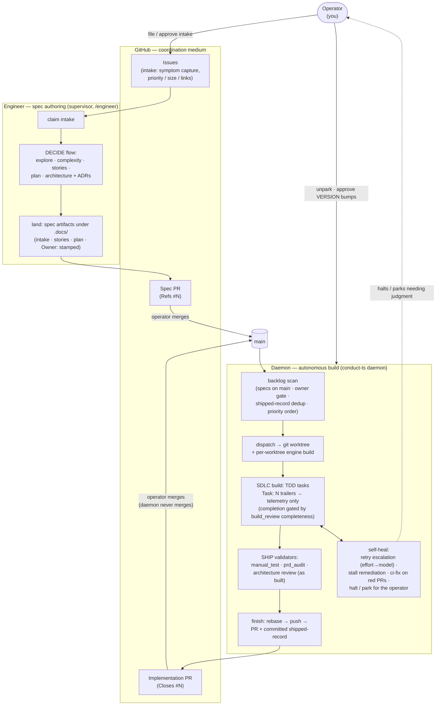

# James Stoup Agents

A custom development harness for Claude Code. Pure Markdown skills and agent personas that enforce
a disciplined SDLC: design docs, user stories with mandatory negative paths, conflict detection,
TDD with domain review, evaluator-gated code review, and dual retrospectives.

No custom runtime. Claude Code is the execution engine.

## Requirements

- [Claude Code](https://docs.anthropic.com/en/.docs/claude-code) v2.0+
- Git
- A project to work on (Rails+PostgreSQL has full tech-context support; other stacks work with generic skills)

## Install

```bash
git clone git@github.com:jstoup111/ai-conductor.git
cd ai-conductor
./bin/install
```

This symlinks all 20 skills into `~/.claude/skills/` and installs the conductor CLI(s) to
`~/.local/bin/`. See [Getting Started](docs/getting-started.md) for the full install
walkthrough (Mermaid renderer setup, verify/update/uninstall, worktree-root guard) and
[Choosing a Conductor](docs/choosing-a-conductor.md) for the `conduct` vs `conduct-ts`
comparison — both binaries coexist, `conduct` is the default, `conduct-ts` is opt-in.

## How the Pieces Fit Together

Three cooperating roles drive every feature from idea to merged PR — the **engineer**
(spec authoring), the **daemon** (autonomous build), and the **operator** (judgment +
merges). GitHub issues/PRs are the coordination medium; the daemon never merges.



- **Engineer**: turns a captured issue into a buildable spec (plan, stories, ADRs) and
  lands it as a spec PR. Investigation lives here — intake stays a plain symptom capture.
- **Daemon**: drains merged specs in priority order, builds each in an isolated worktree
  through the full SDLC, gated on completion by `build_review`'s LLM-judged completeness
  rubric (plan-vs-diff, fail-closed, self-heals via kickback), self-heals stalls and red CI,
  and opens the implementation PR with a committed shipped-record so the work is never
  re-dispatched.
- **Operator**: the only merger. Approves intake priorities, resolves halts the machinery
  escalates, and signs off version bumps.

## Quick Start

```bash
cd your-project/
claude
```

Then in the Claude Code session:

```
/conduct
```

The conductor checks artifact state, tells you what to run next, and blocks when gates
aren't met — walking you from `/bootstrap` through `/finish`. For the full install
walkthrough, the automated `conduct`/`conduct-ts` CLIs, and daemon mode, see
[Getting Started](docs/getting-started.md).

## Key Design Principles

1. **One skill, one responsibility** — Skills have singular focus
2. **Artifacts are the interface** — Skills communicate via files in `.docs/`, not internal orchestration
3. **Negative paths are mandatory** — Every story must have concrete failure scenarios
4. **Evaluator sees fresh context** — No shared state with the generator prevents confirmation bias
5. **Dry business logic, not dry code** — Extract shared behavior, not shared shape
6. **Anything approved twice should be automated** — Pre-approve routine operations
7. **Refactoring happens at batch boundaries** — GREEN phase stays minimal
8. **Every file gets a spec** — Unit specs + request specs, both required
9. **Memory persists across sessions** — Decisions, patterns, gotchas don't get re-discovered
10. **Self-improving** — Retro findings feed back into harness improvements
